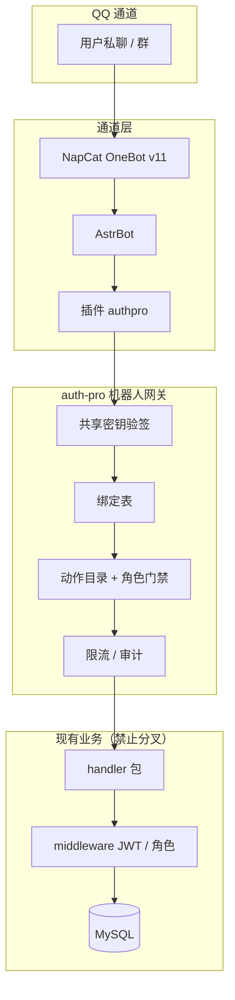
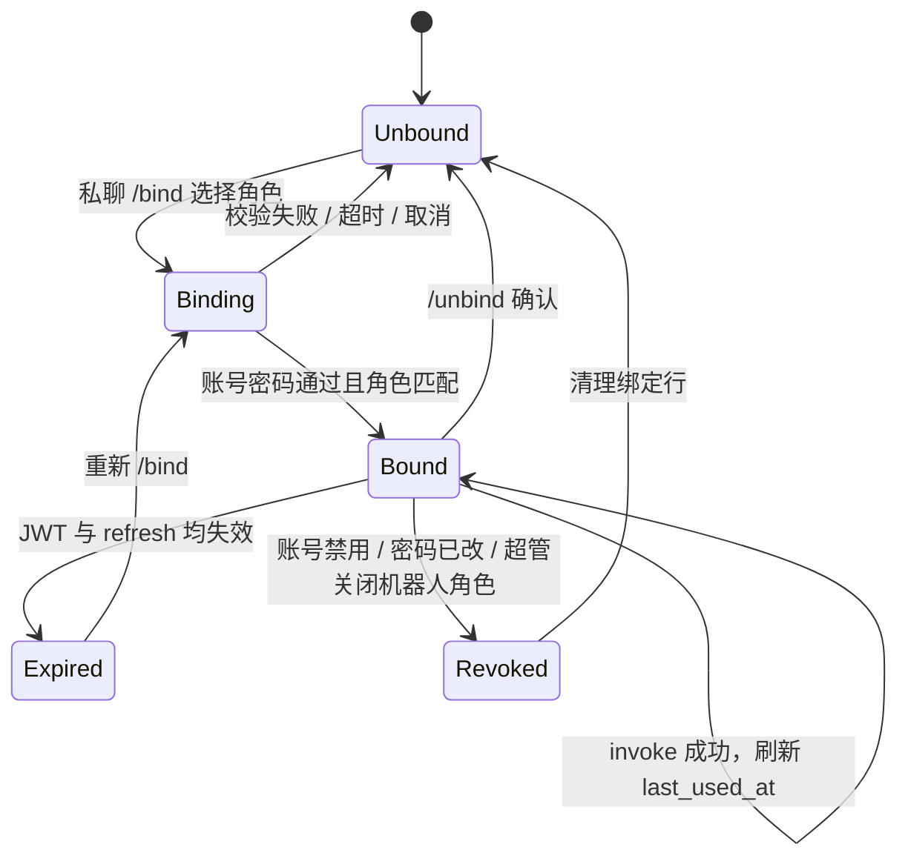
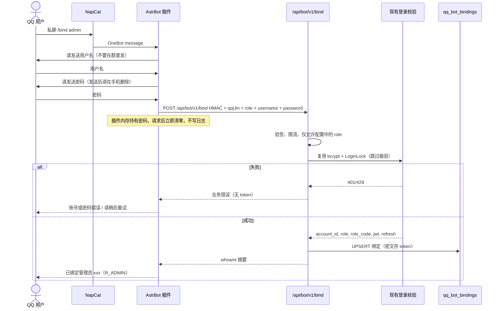
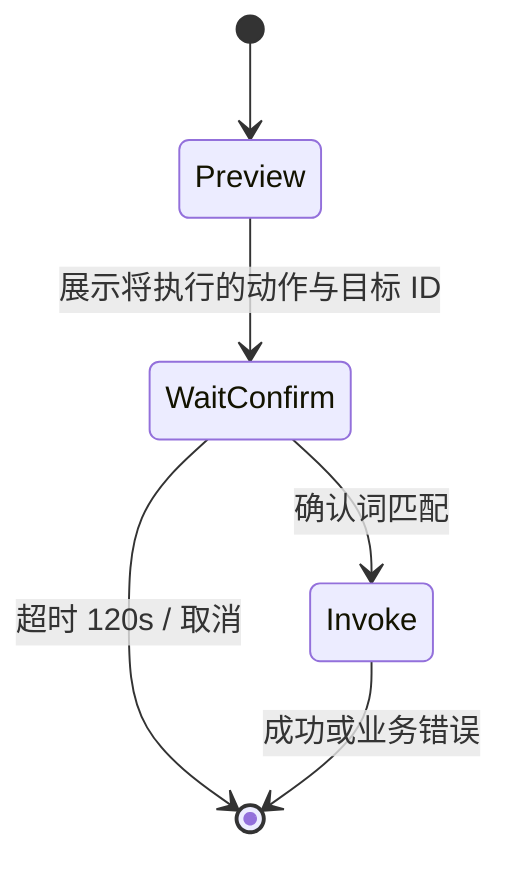

# AuthPro QQ 机器人全量运营：企业级产品与架构设计

| 项 | 值 |
| --- | --- |
| 文档状态 | **已锁定（设计阶段）**。对照 master `@ae37504`（含 PR #23 / #25 / #28 / #29 / #30）。实现未开始。 |
| 读者 | 产品、实现工程师、运维、安全评审、AstrBot 插件作者 |
| 范围 | 用 QQ（NapCat + AstrBot）操作 **全部** 现有 auth-pro 能力：授权、代理、广告、开发者、工单、购买、软件源、模板、卡密、反盗版、通知等 |
| 不在范围 | 本轮 **不写任何实现代码**；不发明平行业务逻辑；不把机器人做成第二套后台；不做「仅推送通知」的只读机器人 |

**锁定决策：auth-pro 是唯一真相源。** 机器人是新通道，不是新系统。业务状态机、价格、审核、配额、支付结算全部复用现有 `/api/*` 处理器与服务。AstrBot 插件只做会话、鉴权上下文与展示。任何「在插件里重写开通授权 / 审核开发者 / 扣余额」的做法视为违规实现。

**锁定决策：机器人不得成为未鉴权后门。** 每条写操作必须先解析 QQ → 已绑定账号 → 角色门禁 → 再调用与面板相同的鉴权链路。共享密钥只证明「调用方是本站 AstrBot」，不授予任何业务权限。

**目录：** [1 目标](#1-背景与目标) · [2 术语](#2-术语表) · [3 架构](#3-架构) · [4 权限矩阵](#4-角色与权限矩阵) · [5 绑定](#5-账号绑定) · [6 UX](#6-命令与会话-ux) · [7 阶段](#7-功能目录与阶段) · [8 数据配置](#8-拟议数据与配置实现阶段才建本文锁定形状) · [9 安全](#9-安全) · [10 错误](#10-错误模型) · [11 部署](#11-部署宝塔友好设计要求) · [12 文件规划](#12-实现阶段的文件规划供后续-pr本轮不创建) · [13 相关文档](#13-与现有设计文档的关系) · [14 验收](#14-验收标准设计完成实现另立-pr)

---

## 1. 背景与目标

### 1.1 问题

运营、代理、开发者今天必须打开浏览器才能完成高频动作：开通授权、加代理、审广告、审入驻、回工单。QQ 群 / 私聊是他们已在使用的工作面，但现有 `station_qq` 只是站点展示字段，系统没有 QQ 运营通道。

若各端各自调登录接口、把 JWT 发进 QQ、或在插件里复制业务，会出现：

- 密钥与口令泄露到群聊；
- 角色越权（代理冒充管理员开通全站授权）；
- 与面板行为漂移（过期规则、套餐校验、审核状态机不一致）；
- 机器人成为绕过极验 / 登录锁定的爆破面。

### 1.2 目标

1. **全能力可运营**：管理端、代理端、用户端、开发者端现有能力均有对应 QQ 动作（分 P0 / P1 / P2 落地，设计一次覆盖）。
2. **角色硬隔离**：`admin` / `agent` / `developer`（代理扩展） / `user` 与现有 JWT `role` + `role_code` 对齐；开发者不是独立账号体系。
3. **绑定后操作**：QQ 号绑定 auth-pro 账号；后续动作使用服务端会话，QQ 里永不回显 token、密码、应用密钥、卡密明文（群聊）或支付商户 Key。
4. **复用 API**：动作目录是现有路由的映射表，不是新业务 API。
5. **可部署**：AstrBot + NapCat 与 auth-pro 并列部署，宝塔友好；默认只监听本机回环。

### 1.3 非目标

| 非目标 | 说明 |
| --- | --- |
| 通知-only 机器人 | 推送可以做，但不能替代操作面 |
| 在 QQ 内完成支付回调 | 易支付 notify / return 仍走现有公开回调，机器人只查单 |
| 在 QQ 内改支付 / 邮件 / 极验密钥 | 超管密钥类配置禁止机器人写入 |
| 代登录（impersonate） | `POST /api/user/:id/impersonate`、`POST /api/agent/:id/impersonate` **禁止** 经机器人暴露 |
| 独立开发者用户名密码入驻 | 线协议已 410；机器人必须走代理 JWT 申请 |
| 平行库存 / 平行授权表 | 禁止 |
| 本轮实现代码 | 本 PR 只交付文档 |

### 1.4 原则

| 原则 | 约束 |
| --- | --- |
| 单一真相 | 许可证、余额、审核状态只存在 auth-pro 库 |
| 薄网关 | `/api/bot/v1/*` 只做：校验机器人身份、解析绑定、注入与面板相同的 JWT 上下文、转发到现有 handler |
| 失败即拒绝 | 参数不合法、角色不够、未绑定、确认未完成 → 不调用业务 handler |
| 密钥不出 QQ | JWT、refreshToken、app_secret、卡密明文、SMTP Key、易支付 Key 不得出现在机器人回复 |
| 破坏性二次确认 | 删除、禁用、驳回、下架、弃用、清日志必须会话确认 |
| 群聊最小暴露 | 群内默认列表脱敏；开授权 / 绑账号 / 回显密钥只走私聊 |

---

## 2. 术语表

| 术语 | 定义 |
| --- | --- |
| NapCat | QQ 协议端，对上暴露 OneBot v11 WebSocket |
| AstrBot | 命令 / 会话引擎，加载本仓库后续提供的 `authpro` 插件 |
| 机器人网关 | auth-pro 上拟议的 `/api/bot/v1/*`，仅 AstrBot 可调用 |
| 绑定 | `qq_uin` ↔ 一个 auth-pro 账号（一种 `role`） |
| 活动身份 | 当前绑定角色；开发者能力是代理绑定上的扩展，不是第二条绑定 |
| 动作 ID | 稳定字符串，如 `license.create`，映射到一条现有 HTTP 路由 |
| 会话 | AstrBot 侧多轮对话：收集字段 → 预览 → 确认 → invoke |
| 面板 | 浏览器 UI：`/admin/*`、`/agent-panel/*`、`/user/*`、`/developer-panel/*`、`/source-station/*` |
| 线协议 | 当前仓库里真实的 JSON 字段名与状态字符串（以代码为准） |

---

## 3. 架构

### 3.1 锁定拓扑

```text
QQ 用户 / 群
    │  OneBot v11 事件（message / notice）
    ▼
NapCat（协议）
    │  反向 WebSocket（推荐）或正向 WS
    ▼
AstrBot + 插件 authpro
    │  HTTPS + HMAC 共享密钥（仅内网或本机）
    ▼
auth-pro  /api/bot/v1/*  （薄网关，契约见开发文档）
    │  注入与面板相同的 JWT Claims，调用现有 handler
    ▼
现有 /api/auth、/api/license/*、/api/agent/*、/api/agent-panel/*、
    /api/user-panel/*、/api/v1/source/*、/api/ticket/*、/api/v1/notifications
```

禁止：

- NapCat 或 AstrBot 直连 MySQL；
- 插件本地实现开通授权 / 扣费 / 审核；
- 把管理员 JWT 写进 AstrBot 配置文件当「万能钥匙」。

### 3.2 组件职责

| 组件 | 做什么 | 不做什么 |
| --- | --- | --- |
| NapCat | QQ 登录、收发消息、群成员事件 | 业务、鉴权、存 token |
| AstrBot 核心 | 路由命令、会话状态、频率限制（通道侧） | 业务规则 |
| 插件 `authpro` | 解析命令、收集参数、调网关、把结果渲染成 QQ 文本 | 计算价格、改状态机 |
| `/api/bot/v1/*` | 验签、绑定、动作白名单、代调现有 handler、脱敏 | 复制 SQL 业务 |
| 现有 handler | 唯一业务实现 | 感知 QQ（除审计字段外） |

### 3.3 逻辑分层



### 3.4 为何是薄网关而不是插件直调现有登录接口

现有登录（`POST /api/auth/login`、`POST /api/agent-panel/login`、`POST /api/user-panel/login`）会：

- 在开启极验时要求浏览器行为验证；
- 把 `token` / `accessToken` 返回给调用方；
- 用客户端 IP 做登录锁定。

QQ 通道无法完成极验。若插件直接调登录接口，要么关掉极验（削弱 Web），要么把 JWT 留在 AstrBot 磁盘（扩大泄露面）。

因此绑定登录 **必须** 走 `POST /api/bot/v1/bind`：在网关内复用 **同一套** bcrypt 校验与 `LoginLockRemaining` / `RecordLoginFailure` / `RecordLoginSuccess`，**跳过极验**（因为调用方已是持有共享密钥的本站机器人），JWT **只写入服务端绑定表**，响应里只回身份摘要。

后续动作走 `POST /api/bot/v1/invoke`：网关取出绑定 JWT（过期则用 refresh 或要求重新绑定），设置与 `middleware.JWTAuth` 相同的 context，再调用现有 handler。禁止在网关里重写 `LicenseCreate` SQL。完整请求形状见 `docs/developer/qq-bot-integration.md`。

---

## 4. 角色与权限矩阵

### 4.1 身份来源（与现网一致）

| 机器人角色 | JWT `role` | JWT `role_code` | 账号表 | 现有登录入口 | 面板 |
| --- | --- | --- | --- | --- | --- |
| 管理员 | `admin` | `R_ADMIN` 或 `R_SUPER` | `admins` | `POST /api/auth/login` | 管理后台 |
| 代理商 | `agent` | （空） | `agents` | `POST /api/agent-panel/login` | `/agent-panel/*` |
| 开发者 | 同代理 `agent`，或存量 `developer` | 存量独立账号为 `R_DEVELOPER` | 代理绑定 `source_developers.agent_id` | 新流程禁止独立登录；存量 `POST /api/v1/source/developer/login` 仅兼容 | `/developer-panel/*` |
| 用户 | `user` | （空） | `users` | `POST /api/user-panel/login` | `/user/*` |

锁定：

- **一条 QQ 绑定恰好一个账号、一种主角色。** 需要换身份必须先解绑再绑。
- **开发者不是第四种绑定主角色。** 代理绑定后，若 `GET /api/v1/source/developer/me` 成功，则动作目录追加开发者动作。
- **`R_SUPER` 专属接口**（系统配置、角色菜单、支付密钥、邮件密钥、插件源、在线更新应用）默认 **不进机器人**。`R_ADMIN` 可做日常运营（开授权、审源站、回工单）。
- 已升级为代理的用户（`users.account_status=converted`）按现网一样拒绝用户端动作，提示去绑代理。

### 4.2 面板对照

| 面板路由（前端） | 后端前缀 | 机器人角色 |
| --- | --- | --- |
| `/dashboard`、`/license/*`、`/admin/agent/*`、`/customer-service/*`、`/piracy/*`、`/source-station/*`、`/tickets`、`/user-manage` | `/api/*` + `JWTAuth` + `RequireAdmin` | admin |
| `/system/*`（配置 / 支付 / 邮件 / 角色 / 菜单） | 同上 + `RequireSuperAdmin` | **机器人禁止**（只读摘要可选，见 P2） |
| `/agent-panel/*` | `/api/agent-panel/*` | agent |
| `/user/dashboard` `/user/licenses` `/user/purchase` `/user/tickets` `/user/profile` `/user/become-agent` | `/api/user-panel/*` | user |
| `/developer-panel/*` | `/api/v1/source/developer/*` | agent（已入驻） |
| `/source-station/*` | `/api/v1/source/admin/*` | admin |
| `/plugin-store` `/online-update` | 超管 | **机器人禁止写** |

### 4.3 权限矩阵（全能力）

图例：`✓` 允许（映射现有 API）；`私` 仅私聊；`确认` 必须二次确认；`禁` 永不经机器人；`—` 无此能力（与面板一致）；`P0/P1/P2` 为落地阶段。

#### 4.3.1 会话与身份

| 动作 ID | 能力 | admin | agent | developer | user | 未绑定 | 阶段 | 现有 / 拟议 API |
| --- | --- | --- | --- | --- | --- | --- | --- | --- |
| `session.help` | 帮助 | ✓ | ✓ | ✓ | ✓ | ✓ | P0 | 插件本地 + `bot.actions` |
| `session.bind` | 绑定 QQ↔账号 | ✓ 私 | ✓ 私 | — | ✓ 私 | ✓ 私 | P0 | `POST /api/bot/v1/bind` → 复用三端登录校验 |
| `session.unbind` | 解绑 | ✓ 确认 | ✓ 确认 | — | ✓ 确认 | — | P0 | `POST /api/bot/v1/unbind` |
| `session.whoami` | 当前身份 | ✓ | ✓ | ✓ | ✓ | — | P0 | `GET /api/bot/v1/whoami` |
| `session.actions` | 我能做什么 | ✓ | ✓ | ✓ | ✓ | ✓（仅 bind/help） | P0 | `GET /api/bot/v1/actions` |
| `auth.web_login` | 浏览器登录 | 禁 | 禁 | 禁 | 禁 | 禁 | — | 现有登录接口不给机器人回 token |
| `auth.impersonate` | 代登录 | 禁 | 禁 | 禁 | 禁 | 禁 | — | `/api/user/:id/impersonate`、`/api/agent/:id/impersonate` |
| `auth.change_password` | 改密 | 禁 | 禁 | 禁 | 禁 | 禁 | — | 各端 `change-password` |
| `auth.register` | 用户注册 | — | — | — | 禁 | 禁 | — | 需邮箱验证码，QQ 无法替代 |

#### 4.3.2 授权（管理端）

| 动作 ID | 能力 | admin | 阶段 | 现有 API |
| --- | --- | --- | --- | --- |
| `license.list` | 授权列表 | ✓ | P0 | `GET /api/license/list` |
| `license.query_user` | 按用户查授权 | ✓ | P1 | `GET /api/license/query-by-user` |
| `license.create` | 开通授权 | ✓ 私 确认 | P0 | `POST /api/license/create` |
| `license.update` | 改授权 | ✓ 确认 | P1 | `PUT /api/license/:id` |
| `license.toggle` | 启用/禁用 | ✓ 确认 | P1 | `PUT /api/license/:id/toggle` |
| `license.delete` | 删除授权 | ✓ 确认 | P2 | `DELETE /api/license/:id` |
| `license.sites` | 绑定站点列表 | ✓ | P1 | `GET /api/license/:id/sites` |
| `license.site_unbind` | 解绑站点 | ✓ 确认 | P1 | `DELETE /api/license/:id/sites/:siteId` |
| `license.dashboard` | 授权概览 | ✓ | P2 | `GET /api/license/dashboard` |
| `license.owners` | 归属账号选项 | ✓ | P0 | `GET /api/license/owners` |
| `license.apps` | 应用下拉 | ✓ | P0 | `GET /api/license/apps` |

#### 4.3.3 授权（代理 / 用户）

| 动作 ID | 能力 | agent | user | 阶段 | 现有 API |
| --- | --- | --- | --- | --- | --- |
| `panel.license.list` | 我的授权 | ✓ | ✓ | P0 | `GET /api/agent-panel/licenses` / `GET /api/user-panel/licenses` |
| `panel.license.update` | 改自己的授权 | ✓ | — | P1 | `PUT /api/agent-panel/licenses/:id` |
| `panel.license.target` | 改绑定目标 | — | ✓ | P1 | `PUT /api/user-panel/licenses/:id/target` |
| `panel.license.refresh_key` | 刷新密钥 | ✓ 私 确认 | ✓ 私 确认 | P1 | `POST .../licenses/:id/refresh-key` |
| `panel.license.sites` | 站点 | ✓ | ✓ | P1 | `GET .../licenses/:id/sites` |
| `panel.license.site_unbind` | 解绑站点 | ✓ 确认 | ✓ 确认 | P1 | `DELETE .../licenses/:id/sites/:siteId` |
| `panel.card.redeem` | 兑换卡密 | ✓ 私 | ✓ 私 | P1 | `POST .../cards/redeem` |
| `panel.versions` | 可下载版本 | ✓ | ✓ | P2 | `GET .../licenses/:id/versions` |
| `panel.version_dl` | 下载短链 | ✓ 私 | ✓ 私 | P2 | `POST .../download-url`（短链只私聊，且不转发完整签名 URL 到群） |

#### 4.3.4 购买 / 财务

| 动作 ID | 能力 | admin | agent | user | 阶段 | 现有 API |
| --- | --- | --- | --- | --- | --- | --- |
| `purchase.options` | 可购应用/套餐 | — | ✓ | ✓（受 `self_purchase_enabled`） | P1 | `GET /api/agent-panel/apps/purchase`、`GET /api/user-panel/apps/purchase` |
| `purchase.create` | 下单开通 | — | ✓ 确认 | ✓ 确认 | P1 | `POST /api/agent-panel/purchase`、`POST /api/user-panel/purchase` |
| `purchase.pay_options` | 支付方式 | — | ✓ | ✓ | P1 | `GET .../purchase/pay-options` |
| `purchase.status` | 查单 | — | ✓ | ✓ | P1 | `GET .../purchase/orders/:orderNo` |
| `recharge.options` | 充值档位 | — | ✓ | ✓ | P2 | `GET .../recharge/options`（用户另有 v2） |
| `recharge.create` | 充值下单 | — | ✓ | ✓ | P2 | `POST .../recharge/orders` |
| `finance.overview` | 财务概览 | — | ✓ | — | P1 | `GET /api/agent-panel/finance/overview` |
| `finance.balance` | 余额 | — | ✓ | ✓ | P1 | `GET .../balance` |
| `admin.agent.recharge` | 后台给代理加款 | ✓ 确认 | — | — | P1 | `POST /api/agent/:id/recharge` |
| `admin.txn.list` | 流水 | ✓ | — | — | P2 | `GET /api/transaction/list` |
| `payment.notify` | 支付回调 | 禁 | 禁 | 禁 | — | `/api/payment/easypay*` |

在线支付：机器人可创建订单并 **私聊** 返回支付链接（若现网返回 URL）；**不得** 在群里发支付 URL。余额 / 额度支付可在确认后直接完成，与面板 `payMethod=balance|quota` 一致。

#### 4.3.5 代理 / 用户 / 等级 / 额度

| 动作 ID | 能力 | admin | agent | user | 阶段 | 现有 API |
| --- | --- | --- | --- | --- | --- | --- |
| `agent.list` | 代理列表 | ✓ | — | — | P1 | `GET /api/agent/list` |
| `agent.create` | 新增代理 | ✓ 私 确认 | — | — | P1 | `POST /api/agent/create`（密码只收不回） |
| `agent.update` | 编辑代理 | ✓ | — | — | P1 | `PUT /api/agent/:id` |
| `agent.toggle` | 冻结/解冻 | ✓ 确认 | — | — | P1 | `PUT /api/agent/:id/toggle` |
| `agent.delete` | 删除代理 | ✓ 确认 | — | — | P2 | `DELETE /api/agent/:id` |
| `agent.levels` | 等级列表 | ✓ | — | — | P1 | `GET /api/agent-level/list` |
| `agent.level.write` | 改等级定义 | ✓ | — | — | P2 | `POST/PUT/DELETE /api/agent-level/*` |
| `quota.*` | 额度 CRUD | ✓ | — | — | P2 | `/api/quota/*` |
| `user.list` | 用户列表 | ✓ | — | — | P1 | `GET /api/user/list` |
| `user.create` | 创建用户 | ✓ 私 | — | — | P1 | `POST /api/user/create` |
| `user.toggle` | 启停用户 | ✓ 确认 | — | — | P1 | `PUT /api/user/:id/toggle` |
| `user.delete` | 删用户 | ✓ 确认 | — | — | P2 | `DELETE /api/user/:id` |
| `upgrade.levels` | 升级代理档位 | — | — | ✓ | P2 | `GET /api/user-panel/agent-upgrade/levels` |
| `upgrade.order` | 升级下单 | — | — | ✓ 确认 | P2 | `POST /api/user-panel/agent-upgrade/orders` |
| `admin.upgrade.*` | 升级订单/转换 | ✓ | — | — | P2 | `/api/admin/agent-upgrade/*` |

`agent.create` 的初始密码：仅用于创建请求，**禁止** 在 QQ 回显。运营应要求代理首次登录改密（现网 `password_changed_at` 机制）。

#### 4.3.6 应用 / 套餐 / 卡密 / 促销

| 动作 ID | 能力 | admin | 阶段 | 现有 API |
| --- | --- | --- | --- | --- |
| `app.list` | 应用管理列表 | ✓ | P1 | `GET /api/app/list` |
| `app.create` | 创建应用 | ✓ | P1 | `POST /api/app/create`（`app_secret` 只私聊一次或只提示「请到面板查看」——**推荐后者**，机器人响应删除 `appSecret` 字段） |
| `app.update` | 更新应用 | ✓ | P2 | `PUT /api/app/:id` |
| `app.reset_secret` | 重置密钥 | 禁 | — | `PUT /api/app/:id/reset-secret` |
| `app.delete` | 删应用 | ✓ 确认 | P2 | `DELETE /api/app/:id` |
| `plan.list` | 套餐 | ✓ | P0 | `GET /api/plan/list` |
| `plan.write` | 套餐 CRUD | ✓ | P2 | `/api/plan/*` |
| `card.batch.*` | 卡密批次 | ✓ 私 | P2 | `/api/license/cards/batches*`（导出明文禁群） |
| `promo.*` | 促销活动 | ✓ | P2 | `/api/promotion/campaigns` |

#### 4.3.7 工单

状态机与面板完全一致：`pending` → `replied` → `closed`；创建人回复已回复工单会拉回 `pending`。

| 动作 ID | 能力 | admin | agent | user | 阶段 | 现有 API |
| --- | --- | --- | --- | --- | --- | --- |
| `ticket.list` | 列表 | ✓ | ✓ | ✓ | P1 | `GET /api/ticket/list` 或 `GET .../tickets` |
| `ticket.unread` | 未读数 | ✓ | ✓ | ✓ | P1 | `GET .../unread-count` |
| `ticket.detail` | 详情 | ✓ | ✓ | ✓ | P1 | `GET /api/ticket/:id` 或 `GET .../tickets/:id` |
| `ticket.create` | 建单 | — | ✓ | ✓ | P1 | `POST .../tickets` |
| `ticket.reply` | 回复 | ✓ | ✓ | ✓ | P1 | `POST /api/ticket/:id/reply` 或 `POST .../replies` |
| `ticket.close` | 关闭 | ✓（status） | ✓ | ✓ | P1 | `PUT /api/ticket/:id/status` `{action:close}` / `PUT .../close` |
| `ticket.reopen` | 重开 | ✓ | — | — | P1 | `PUT /api/ticket/:id/status` `{action:reopen}` |

分类白名单（现网）：`authorization` / `payment` / `deploy` / `other`。标题 ≤60 字，内容 ≤2000 字。

#### 4.3.8 源站开发者与目录

目录项状态（线协议，见 `docs/developer/review-and-catalog.md`）：`draft` → `review` → `approved` → `published`；另有 `rejected` / `hidden` / `deprecated`。

入驻申请：`pending` → `approved` | `rejected`；取消开发者删除资格（PR #28 / #30）。

| 动作 ID | 能力 | admin | agent | developer | 阶段 | 现有 API |
| --- | --- | --- | --- | --- | --- | --- |
| `dev.apply` | 申请入驻 | — | ✓ | — | P1 | `POST /api/v1/source/developer/apply` |
| `dev.apply_status` | 申请状态 | — | ✓ | — | P1 | `GET /api/v1/source/developer/apply/status` |
| `dev.me` | 开发者资料 | — | ✓ | ✓ | P1 | `GET /api/v1/source/developer/me` |
| `dev.items` | 我的条目 | — | — | ✓ | P1 | `GET /api/v1/source/developer/items` |
| `dev.plugin.upsert` | 登记插件草稿 | — | — | ✓ | P2 | `POST/PUT /api/v1/source/developer/plugins` |
| `dev.plugin.submit` | 提交审核 | — | — | ✓ 确认 | P1 | `POST /api/v1/source/developer/plugins/:id/submit` |
| `dev.template.*` | 模板对等动作 | — | — | ✓ | P2 | `/api/v1/source/developer/templates*` |
| `dev.ad.create` | 申请广告 | — | — | ✓ | P1 | `POST /api/v1/source/developer/ad-applications` |
| `dev.ad.list` | 我的广告申请 | — | — | ✓ | P1 | `GET /api/v1/source/developer/ad-applications` |
| `src.app.list` | 待审入驻 | ✓ | — | — | P1 | `GET /api/v1/source/admin/applications` |
| `src.app.approve` | 通过入驻 | ✓ 确认 | — | — | P1 | `POST /api/v1/source/admin/applications/:id/approve` |
| `src.app.reject` | 驳回入驻 | ✓ 确认 | — | — | P1 | `POST .../reject` |
| `src.app.freeze` | 取消申请 | ✓ 确认 | — | — | P1 | `POST .../freeze` |
| `src.dev.list` | 开发者列表 | ✓ | — | — | P1 | `GET /api/v1/source/admin/developers` |
| `src.dev.freeze` | 取消开发者 | ✓ 确认 | — | — | P1 | `POST /api/v1/source/admin/developers/:id/freeze` |
| `src.plugin.approve/reject/shelf/unshelf/deprecate` | 插件审核上架 | ✓ 确认 | — | — | P1 | `/api/v1/source/admin/plugins/:id/*` |
| `src.template.*` | 模板对等 | ✓ 确认 | — | — | P1 | `/api/v1/source/admin/templates/:id/*` |
| `src.ad.list` | 广告投放列表 | ✓ | — | — | P1 | `GET /api/v1/source/admin/advertisements` |
| `src.ad.upsert` | 新增/改广告 | ✓ | — | — | P1 | `PUT /api/v1/source/admin/advertisements` |
| `src.ad.delete` | 删广告 | ✓ 确认 | — | — | P1 | `DELETE /api/v1/source/admin/advertisements/:id` |
| `src.ad.app.approve/reject` | 审广告申请 | ✓ 确认 | — | — | P1 | `/api/v1/source/admin/ad-applications/:id/*` |
| `src.catalog.*` | 分类 / 目录 / index 重建 | ✓ | — | — | P2 | `/api/v1/source/admin/categories`、`/index/regenerate` |
| `src.package.parse/publish` | ZIP 发包 | ✓ | — | — | P2 | 文件上传，QQ 通道不适配；引导去面板 |
| `src.settings.release` | 源站发布设置 | 禁写 | — | — | — | 含外部仓库凭证，禁止机器人写 |

锁定：**开发者提交不得写成 `published`。** 机器人 invoke 不得给开发者动作附加 `shelf=true` 以绕过审核。

#### 4.3.9 反盗版 / 校验日志 / 仪表盘

| 动作 ID | 能力 | admin | 阶段 | 现有 API |
| --- | --- | --- | --- | --- |
| `piracy.tracking.list` | 追踪列表 | ✓ | P2 | `GET /api/piracy/tracking/list` |
| `piracy.tracking.block` | 封禁 | ✓ 确认 | P2 | `PUT /api/piracy/tracking/:id/block` |
| `piracy.alert.*` | 告警 | ✓ | P2 | `/api/piracy/alert/*` |
| `piracy.blacklist.*` | 黑名单 | ✓ | P2 | `/api/piracy/blacklist/*` |
| `verify.log.list` | 校验日志 | ✓ | P2 | `GET /api/verify-log/list` |
| `verify.log.clear` | 清空日志 | ✓ 确认 | P2 | `DELETE /api/verify-log/clear` |
| `dash.overview` | 仪表盘 | ✓ | P2 | `GET /api/dashboard/overview` 等 |

#### 4.3.10 通知

现网已有站内信（PR #29）：`GET /api/v1/notifications`，tab = `notice` / `message` / `todo`。

| 动作 ID | 能力 | 全绑定角色 | 阶段 | 现有 API |
| --- | --- | --- | --- | --- |
| `notify.list` | 拉通知 | ✓ | P1 | `GET /api/v1/notifications` |
| `notify.unread` | 未读数 | ✓ | P1 | `GET /api/v1/notifications/unread-count` |
| `notify.read` | 标已读 | ✓ | P1 | `POST /api/v1/notifications/:id/read` |
| `notify.push` | 事件推到 QQ | 可选订阅 | P2 | **不是新业务**：网关订阅现有 `notification_emit`，按绑定表投递私聊 |

禁止再做一套「QQ 专用通知表」。推送只是站内信的投递通道。

#### 4.3.11 明确禁止（即使管理员要求）

| 能力 | 现有 API | 原因 |
| --- | --- | --- |
| 读/写系统配置密钥 | `PUT /api/system/config`、支付 / 邮件 / 实名 / 极验 Key | 密钥面 |
| 应用在线更新 | `POST /api/system/update/apply` | 可摧毁生产 |
| 角色 / 菜单改造 | `/api/role/*` `/api/menu/*` | 超管面，误操作不可逆 |
| 代登录 | impersonate | 等于交出他人会话 |
| 重置应用密钥并回显 | `reset-secret` | 密钥会进聊天记录 |
| 安装向导 | `/api/install/*` | 未安装系统无绑定模型 |
| 公开校验伪造 | `POST /api/license/verify` | SDK 通道，不是运营动作 |

机器人配置本身（开关、共享密钥、允许角色）只允许 **超管在 Web 系统设置** 写入，见 §9。不在本设计阶段发明独立「QQ 机器人」一级菜单。

---

## 5. 账号绑定

### 5.1 状态机



规则：

- `qq_uin` 全局唯一绑定一行（同一 QQ 不能同时绑管理员和代理）。
- 同一 auth-pro 账号允许换 QQ：新绑定成功后旧 QQ 行作废。
- `RequireFreshPassword`：若 `password_changed_at` 晚于绑定写入的 token `iat`，状态变 `Revoked`，提示重新绑定。
- 用户已 `converted`：拒绝以 `user` 绑定，提示用代理账号。
- 开发者资格冻结 / 删除：主绑定仍是代理；开发者动作从目录消失。

### 5.2 绑定序列（密码方式，仅私聊）



### 5.3 绑定请求语义（实现阶段契约，详见开发文档）

网关绑定 **不返回** `token` / `refreshToken` / `accessToken`。

校验分支（必须调用现有查询，不得另写一套哈希）：

| `role` | 查表 | 成功条件 | 写入 JWT 时的 Claims |
| --- | --- | --- | --- |
| `admin` | `admins` `enabled=1` + `roles.role_code` | bcrypt 通过 | `Role=admin`，`RoleCode=R_ADMIN\|R_SUPER`，TTL 24h + refresh 7d（与 `handler.Login` 一致） |
| `agent` | `agents` `email/contact` + `enabled=1` | bcrypt 通过 | `Role=agent`，TTL 7d（与 `AgentPanelLogin` 一致） |
| `user` | `users` 邮箱/手机/ID + `enabled` + 未 converted | bcrypt 通过 | `Role=user`，TTL 7d（与 `UserLogin` 一致） |

存量 `developer` 独立账号：P1 可用 `role=developer` 走 `SourceDeveloperLogin` 的同一套校验；新客户只绑代理再入驻。

### 5.4 解绑

`POST /api/bot/v1/unbind`：校验 HMAC + QQ；删除绑定行；使存储的 JWT 不可再用。QQ 侧需确认词 `确认解绑`。

---

## 6. 命令与会话 UX

### 6.1 通道规则

| 场景 | 私聊 | 群聊 |
| --- | --- | --- |
| `/help` `/whoami` `/actions` | ✓ | ✓（whoami 不显示邮箱全称，只显示角色 + 掩码账号） |
| `/bind` 及密码 | ✓ | **拒绝**，提示转私聊 |
| `/license open` 及密钥类结果 | ✓ | 可发起，**结果改私聊**；群内只回「已私聊发送」 |
| 列表查询 | ✓ | ✓，授权密钥字段删除或掩码 |
| 删除 / 禁用 / 驳回 / 弃用 | ✓ 确认 | ✓ 确认，且建议管理员群 + 机器人管理员名单 |
| 支付链接 / 卡密 / 下载 URL | ✓ | 拒绝，转私聊 |
| @机器人 或 命令前缀 | 前缀 `/` 或 `ap ` | 必须 `@机器人` 或配置的群前缀，避免误触发 |

群聊发送者必须是绑定 QQ。未绑定者除 help / bind 提示外一律忽略或回一句「请私聊绑定」。

### 6.2 命令形态

两种等价入口，插件必须都认：

1. **斜杠命令**：`/license open`、`/agent add`；
2. **自然语言短句**（P1）：「开通授权 应用1 套餐包年 用户 mailbox@x.com」。

P0 只保证斜杠命令。会话收集缺失字段，而不是一条消息塞全部 JSON。

### 6.3 开通授权会话（P0 管理员）

```text
用户: /license open
机器人: 请选择应用（回复序号）
        1. 演示应用 (id=1)
        2. ...
用户: 1
机器人: 请选择套餐
        1. 包年 ￥199 domain (planId=3)
用户: 1
机器人: 授权类型：1 单域名 2 泛域名 3 IP 4 密钥
用户: 4
机器人: 归属：1 用户 2 代理。请发「1 邮箱或账号」或「2 代理联系方式」
用户: 1 user@example.com
机器人: 预览
        应用=演示应用 套餐=包年 类型=密钥 归属=用户#12
        回复「确认开通」执行，「取消」放弃（120 秒）
用户: 确认开通
机器人: 已创建授权 id=88。密钥已省略，请到管理端授权列表查看。
```

`type=key` 时现网会生成 `license_key`。机器人 **默认不回密钥**；若运营强烈需要，仅私聊回一次，并写审计 `secret_revealed=1`。产品默认：不回显。

### 6.4 破坏性确认



确认词白名单：`确认`、`确认开通`、`确认删除`、`确认驳回`、`确认解绑`。其它输入视为取消或重新收集。

### 6.5 帮助按角色裁剪

`/help` 只打印当前身份 P 阶段已开放的命令。未绑定只打印绑定说明。

---

## 7. 功能目录与阶段

阶段只约束 **实现顺序**，不缩小设计覆盖面。

### 7.1 P0 — 通道可运营（本设计之后的第一个实现 PR）

- 网关：配置键、HMAC、绑定 / 解绑 / whoami / actions / invoke。
- 插件：`/bind` `/unbind` `/whoami` `/help` `/license open` `/license list`。
- 映射：`license.create`、`license.list`（admin）；代理/用户仅 `panel.license.list` 若已绑定对应角色。
- 安全：私聊绑定、token 不出 QQ、限流、审计。

### 7.2 P1 — 日常运营闭环

- 代理 CRUD（无删除）、用户列表/创建/启停、后台给代理加款。
- 代理/用户购买（余额/额度）、查单、财务余额。
- 工单全流程。
- 开发者入驻申请 / 审核 / 取消；插件/模板 **审核与上架**（不做 QQ 上传 ZIP）。
- 广告投放 upsert/list/delete；广告申请审批；开发者提交广告申请。
- 站内信列表 / 未读。
- 授权改期、启停、站点解绑、卡密兑换。

### 7.3 P2 — 全量对齐

- 卡密批次、促销、额度、代理等级定义、应用版本、仪表盘、反盗版、校验日志。
- 开发者草稿登记（元数据 URL，无文件）。
- 源站分类 / 重建 index。
- 站内信推送到 QQ。
- 充值与升级代理在线支付链接（仅私聊）。
- 超管只读：站点名、机器人开关状态（不含密钥）。

### 7.4 明确延后到面板的能力

ZIP 发包、首页模板上传、SDK 打包下载、软件源 Git 刷新、实人认证扫脸、在线更新应用。机器人只给面板深链（相对路径，如 `/source-station/packages`）。

---

## 8. 拟议数据与配置（实现阶段才建，本文锁定形状）

### 8.1 表 `qq_bot_bindings`

| 列 | 类型 | 约束 | 说明 |
| --- | --- | --- | --- |
| id | BIGINT PK | | |
| qq_uin | VARCHAR(32) | UNIQUE | 纯数字 QQ 号 |
| role | VARCHAR(16) | | `admin` / `agent` / `user` / `developer`（仅存量） |
| account_id | BIGINT | | 对应 admins/agents/users/developers.id |
| username | VARCHAR(128) | | 展示用，非密钥 |
| role_code | VARCHAR(32) | | 如 `R_SUPER` |
| access_token_enc | BLOB | | 应用层加密后的 JWT |
| refresh_token_enc | BLOB | | 可空 |
| token_expires_at | DATETIME | | |
| bound_at | DATETIME | | |
| last_used_at | DATETIME | | |
| revoked_at | DATETIME | 可空 | |

禁止把明文 JWT 写入日志。加密密钥使用独立文件（类似 `jwt.secret`），例如数据目录 `bot_token.enc.key`，不进 Git。

### 8.2 表 `qq_bot_audit_logs`

| 列 | 说明 |
| --- | --- |
| id / created_at | |
| qq_uin / role / account_id | 操作者 |
| chat_type | `private` / `group` |
| group_id | 可空 |
| action_id | 如 `license.create` |
| mapped_method / mapped_path | 如 `POST /api/license/create` |
| success | bool |
| result_code | 业务 code |
| error_msg | 已脱敏 |
| confirm_token | 确认会话 ID |
| secret_revealed | 是否破例回显过密钥 |

### 8.3 `system_configs` group=`bot`

沿用现有 `system_configs` 表，**不新建配置中心**。键名锁定：

| key | 默认 | 说明 |
| --- | --- | --- |
| `enabled` | `0` | 总开关；关闭则所有 `/api/bot/v1/*` 返回 403 |
| `shared_secret` | 空 | 写入后只回 `sharedSecretSet=true`，与极验 Key 相同策略 |
| `allowed_roles` | `admin` | 逗号分隔：`admin,agent,developer,user` |
| `allow_group` | `1` | 是否接受群命令 |
| `admin_group_ids` | 空 | 允许执行管理写操作的群；空则管理写操作仅私聊 |
| `rate_limit_per_min` | `20` | 每 QQ 每分钟 invoke 上限 |
| `bind_fail_lock` | 复用登录锁定 | 文档要求复用 `middleware` 登录锁定常量：账号 5 次 / IP 20 次 / 10 分钟 |
| `astrbot_base_url` | 空 | 可选，供以后推送通知；**不是** 鉴权依据 |
| `napcat_ws_note` | 空 | 运维备注（反向 WS 地址），只存不连 |

超管 Web：在现有「系统设置」**增加一个 Tab「QQ 机器人」**，只编辑上述键。本设计阶段不实现该 Tab。禁止为此单独做一套假菜单。

公开 `GET /api/system-config/public` **不得** 增加共享密钥或 enabled 以外的内部字段。最多以后加 `botEnabled` 布尔给登录页展示「支持 QQ 绑定」，P2 可选。

---

## 9. 安全

### 9.1 威胁与控制

| 威胁 | 控制 |
| --- | --- |
| 未授权调用网关 | HMAC-SHA256（时间戳 + nonce + body），窗口 ±300s，nonce 重放缓存 |
| 共享密钥泄露 | 仅超管可轮换；泄露后旧绑定仍有效但攻击者还需 QQ 事件源——因此 NapCat / AstrBot 必须本机回环 |
| 群内盗号伪造 | 以 OneBot `user_id` 为准，不信任消息文本里的「我是管理员」 |
| 撞库 | 复用登录锁定；绑定失败计入同一计数器 |
| Token 泄露到 QQ | 响应 schema 剥离 token 字段；插件层二次过滤 |
| 越权 | 动作目录按角色裁剪；invoke 后再走现有 `RequireAdmin` / `RequireAgent` / `RequireDeveloper` / `RequireActiveUser` |
| 管理员误删 | 二次确认 + 审计 |
| 机器人被拉进陌生群 | `admin_group_ids`；非名单群忽略写命令 |
| 提示词注入 | 插件只解析命令，不把用户文本当系统指令执行 |

### 9.2 限流

- 通道侧：AstrBot 对同一 QQ 命令冷却（建议 1 秒）。
- 网关侧：`rate_limit_per_min`；超过返回业务码 429。
- 卡密兑换额外遵守现网 `licenseCardRedeemLimiter`。

### 9.3 脱敏规则（插件渲染强制）

从 handler JSON 删除或掩码后再发 QQ：

- `token` `refreshToken` `accessToken` `appSecret` `app_secret` `easypayMerchantKey` `geetestCaptchaKey` `password` `passwordHash`
- `licenseKey` / `license_key`：群聊删除；私聊默认删除，除非动作标记 `secret_revealed` 且管理员配置允许
- 卡密 `cardCode` 列表：仅私聊，且分页警告
- 邮箱：群聊显示 `u***@domain`

### 9.4 审计

每次 invoke 写 `qq_bot_audit_logs`。管理端查询可 P2 挂到现有日志习惯；P0 至少落库可 SQL 查。

---

## 10. 错误模型

与现网一致：**HTTP 状态多为 200**，业务用 `code` + `msg`。网关不得改写业务 `msg`，可加 `actionId`。

| code | 含义 | 典型来源 |
| --- | --- | --- |
| 200 | 成功 | 现有 handler |
| 400 | 参数错误 | 绑定校验、确认过期、动作参数 |
| 401 | 未绑定 / 令牌失效 / 账号密码错 | 网关或登录复用 |
| 403 | 角色不足 / 机器人总关 / 角色未启用 / 用户端关闭自购 | 网关或现有中间件 |
| 404 | 资源不存在 | 现有 handler |
| 410 | 独立开发者登录已废弃 | `sourceDeveloperApplyGate` |
| 429 | 限流 / 登录锁定 | 网关或 `LoginLockRemaining` |
| 500 | 内部错误 | 现有 handler |

插件把 `code!=200` 渲染为：「失败（code）：msg」。

---

## 11. 部署（宝塔友好，设计要求）

推荐同机进程：

```text
127.0.0.1:19127   auth-pro（HOST=127.0.0.1，Nginx 反代 443）
127.0.0.1:6185    NapCat OneBot（仅本机）
127.0.0.1:6180    AstrBot WebUI（仅本机或走面板登录）
```

- NapCat → AstrBot：**反向 WS**，AstrBot 为 WS 服务端，NapCat 填 `ws://127.0.0.1:<astrbot-onebot-port>/ws`（以实际 AstrBot OneBot v11 适配器文档为准，见开发文档）。
- AstrBot → auth-pro：`https://<本站域名>/api/bot/v1/*` 或 `http://127.0.0.1:19127/api/bot/v1/*`。生产优先本机 HTTP，避免证书与绕网。
- 安全组 / 宝塔防火墙：**不要** 把 NapCat / AstrBot 端口映射到 0.0.0.0 公网。
- QQ 协议风险：使用小号、遵守腾讯用户协议；本设计不保证号不被风控。
- 进程守护：宝塔 Supervisor 或 systemd，与 auth-pro 二进制并列。
- 备份：绑定表与 `bot_token.enc.key`、`bot.shared_secret` 与数据库一起备份。

详细步骤见 `docs/developer/qq-bot-integration.md`。

---

## 12. 实现阶段的文件规划（供后续 PR，本轮不创建）

| 路径 | 职责 |
| --- | --- |
| `backend/handler/bot_gateway.go` | bind / unbind / whoami / actions / invoke |
| `backend/handler/bot_actions.go` | 动作目录与角色矩阵（数据，不是业务） |
| `backend/handler/bot_audit.go` | 审计写入 |
| `backend/middleware/bot_hmac.go` | HMAC 中间件 |
| `backend/main.go` | 注册 `/api/bot/v1` 组（无 JWT，改 HMAC） |
| `frontend/src/views/system/config/index.vue` | 超管 Tab「QQ 机器人」（只编 keys） |
| `integrations/astrbot-authpro/` | 插件与 README |

测试：网关单测必须覆盖「无 HMAC → 拒绝」「错角色 → 不进 LicenseCreate」「绑定响应无 token」。

---

## 13. 与现有设计文档的关系

| 文档 | 关系 |
| --- | --- |
| `docs/design/software-source-enterprise.md` | 源站状态机、开发者必审、管理员直发——机器人必须遵守，不得用 invoke 给开发者写 `published` |
| `docs/developer/review-and-catalog.md` | 广告申请 `pending/approved/rejected`；目录状态文案 |
| `docs/developer/qq-bot-integration.md` | 本设计的实现契约 |
| `docs/developer/qq-bot-command-reference.md` | 命令与会话的操作规范 |

---

## 14. 验收标准（设计完成；实现另立 PR）

实现 PR 不得声称「已全量对齐」。宣称完成某阶段时必须：

1. 该阶段动作均可由对应角色在 QQ 走通；
2. 同一动作在面板执行结果一致（同一 handler）；
3. 抓包 / 日志中无 JWT、密码、app_secret；
4. 未绑定 QQ 无法开通授权；
5. 代理绑定无法调用 `POST /api/license/create`（管理端开通）。

---

## 15. 变更记录

| 日期 | 变更 | 兼容性 |
| --- | --- | --- |
| 2026-09-20 | 首版企业级设计锁定：NapCat + AstrBot + 薄网关；全能力矩阵；P0/P1/P2 | 无运行时变更 |
