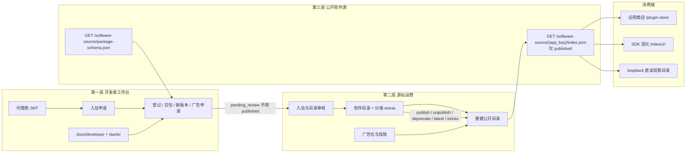
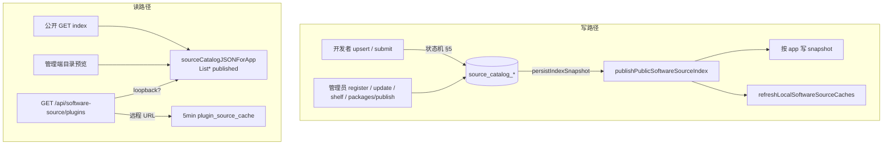
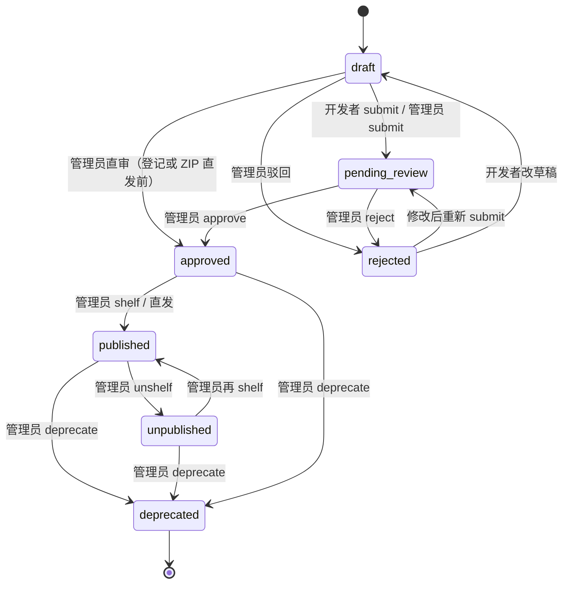
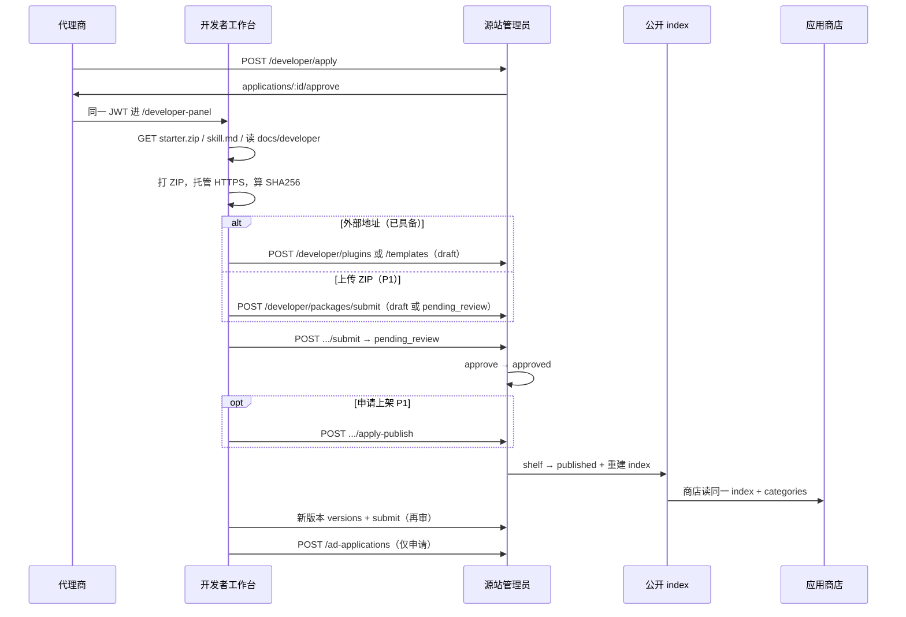

# AuthPro 源站 + 开发者适配：企业级设计说明

| 项 | 值 |
| --- | --- |
| 文档状态 | 已锁定（实现对照 master `@ae5abd7`，含 PR #23 / #25） |
| 读者 | 实现工程师、源站运营、SDK / 商店消费端 |
| 范围 | 源站运营、第三方开发者工作台、公开软件源 index、应用商店消费 |
| 不在范围 | 授权核销、卡密、在线更新整包、广告创意视觉重做 |

**锁定决策：管理员可直发，开发者必审。** 开发者任何写入只能落到 `draft` / `pending_review`（线协议现名 `review`），不得把条目写成 `published`。管理员登记、ZIP 发包、`shelf=true` 可跳过或自动走完审核并上架。本决策不开放例外。

---

## 1. 背景与目标

### 1.1 问题

源站、开发者工作台、消费端应用商店曾经叠在同一套「目录感觉」上，但契约不闭合：

- 运营改状态后，公开 `index.json` 与商店页签不同步。
- 分类 extras 进不了商店；模板与插件靠运营手选，而不是清单 `kind`。
- 开发者文档与硬校验互相漂移。
- 开发者无法形成「入驻 → 交包 → 审核 → 上架进商店」闭环。

PR #23 / #25 已补上目录编辑、分类进商店、`kind` 硬约束、上架/下架/弃用自动重建公开目录。本文把三层边界、角色、状态机、包契约与落地缺口写成实现规格，禁止再发明平行 API。

### 1.2 目标

1. **三层分离**：开发者工作台只交包与等审；源站负责审核、目录、分类、广告位；公开软件源 index 是消费端唯一真相。
2. **单一真相**：`GET /software-source/{app_key}/index.json` 只反映 `published`。`unpublished` / `deprecated` 不得出现。
3. **角色分离**：同一 JWT 体系，权限按角色硬拦。
4. **契约先行**：`plugin.json` / `template.json` / `package-schema.json` / 公开 index schema 与校验器同变更。
5. **动作有后果**：上架、下架、弃用、改元数据、换 latest、改 extras 必须重建公开目录。
6. **模板插件化但可区分**：模板走同一目录与版本机，但 `kind:"template"` → 分类 `home-template` → 写入 `homeTemplates[]`，不得混入 `plugins[]`。

### 1.3 原则

| 原则 | 约束 |
| --- | --- |
| 契约先行 | 先改 schema / 文档 / 校验，再改 UI |
| 失败即拒绝 | ZIP 不合规不写库、不推 Release、不留临时文件 |
| 源站不存源码 | 只存元数据 + HTTPS 地址 + SHA256 |
| 应用隔离 | 每条目强制 `appId`；SDK 只固化带 `app_key` 的 index |
| 下架 ≠ 卸载 | 只改公开目录，不远程卸载已安装实例 |
| 回环直读 | 本机 / loopback 软件源读现算目录，禁止 5 分钟脏缓存挡住刚上架/弃用 |

---

## 2. 术语表

| 术语 | 定义 |
| --- | --- |
| 源站 | 本实例的软件源运营面。后台路由 `/source-station/*`，管理 API `/api/v1/source/admin/*` |
| 开发者工作台 | 代理商 JWT 扩展后的第三方面板 `/developer-panel/*`，API `/api/v1/source/developer/*` |
| 公开软件源 | 无鉴权 `GET /software-source/{app_key}/index.json`（兼容见 §6） |
| 消费端 / 应用商店 | 管理端「应用商店」`/plugin-store`，读同一份 index 的 `plugins` + `homeTemplates` + `categories` |
| 目录项 | 一条插件或一条首页模板（含多版本） |
| kind | 包类型。`plugin` 或 `template`。与分类 kind 必须一致 |
| 分类 extras | 运营新增的非内置分类，写入 index.`categories`，商店生成二级页签 |
| latest | 目录项对外展示版本指针；公开 index 只暴露 latest 的地址与校验和 |
| 直发 | 管理员跳过或自动完成审核并 `published` |
| 必审 | 开发者提交后必须经管理员 approve + shelf（或管理员直发代替） |
| 线协议名 | 当前库内存的状态字符串。企业名与线协议名对照见 §5 |
| 硬校验 | `parseSourcePackageBytes` + `package-schema.json`，失败返回中文 `msg` + `{field,rule}` |

---

## 3. 角色与权限矩阵

### 3.1 身份

| 角色 | 身份来源 | JWT | 入口 |
| --- | --- | --- | --- |
| 代理商（未入驻） | `role=agent` | 代理商 token | `/agent-panel/become-developer` |
| 开发者 | 代理商已绑定 `agent_id` 开发者资格；存量独立账号仍可读 | **同一套 JWT**（`RequireDeveloper` 接受 `developer` 或已绑定的 `agent`） | `/developer-panel/*` |
| 管理员 | `role=admin`（`R_ADMIN` / `R_SUPER`） | 管理端 token | `/source-station/*` |
| 匿名消费者 | 无 | 无 | 公开 index、`package-schema.json` |
| 消费端商店 | 管理端超管 | 管理端 JWT | `/plugin-store`、`GET /api/software-source/plugins` |

未登录的旧 `POST /api/v1/source/developer/apply` 返回 **410**。新申请必须带代理商 JWT。每个代理商最多一条待审或已启用绑定。

### 3.2 权限矩阵

| 动作 | 开发者 | 管理员 | 匿名 / 商店 |
| --- | --- | --- | --- |
| 入驻申请 / 查状态 | 代理商可申请；开发者只读状态 | 通过 / 拒绝 / 冻结 | 否 |
| 读文档 / starter.zip / skill.md | 是 | 是（管理端另有文档页） | schema 公开；starter 需开发者 JWT |
| 登记元数据（URL + SHA256） | 是 → `draft` | 是；`shelf=true` 可直发 | 否 |
| 上传 ZIP 硬校验 | **待补齐**（现仅管理端） | `packages/parse`、`packages/publish` | 否 |
| 提交审核 | `POST .../submit` → `pending_review` | 可不经此步直发 | 否 |
| 审核通过 / 驳回 | 否 | 是 | 否 |
| 上架 / 下架 | 否（可 **申请上架**，待补齐） | 是 | 否 |
| 弃用条目 / 版本 | 否 | 是；重建公开目录 | 否 |
| 设 latest | 否 | 是 | 否 |
| 编辑已上架元数据 | 否（已发布版本地址不可改） | `PUT .../:id`，状态保持 `published` | 否 |
| 管理分类 extras | 只读列表 | 读写；保存后重建 index | 商店只读 index.categories |
| 广告 | 仅申请 | 审批 + 投放配置 | 公开广告位 |
| 读公开 index | 是 | 是 | 是 |
| 重生快照 | 否 | `POST /index/regenerate`（保留，非主路径） | 否 |

**禁止**：给开发者挂 `.../shelf`、`.../unshelf`、`.../deprecate`、`packages/publish?shelf=1`。实现评审若出现这类路由，直接拒收。

---

## 4. 架构图

三层：开发者工作台 → 源站审核 / 目录 → 公开软件源 index。商店与 SDK 只读第三层。





实现锚点（不要新开平行服务）：

| 层 | 代码 |
| --- | --- |
| 路由注册 | `backend/handler/source_station.go` `RegisterSourceStationRoutes` |
| 公开 index | `backend/handler/source_station_app.go` `SourceStationIndex` / `sourceCatalogJSONForApp` |
| 重建 | `backend/handler/source_station_index.go` `publishPublicSoftwareSourceIndex` |
| 硬校验 | `backend/handler/source_station_package.go` |
| 商店聚合 | `backend/handler/plugin_source.go` |
| 开发者 JWT | `backend/middleware/jwt.go` `RequireDeveloper` |

---

## 5. 状态机

### 5.1 企业名与线协议名

库内 / HTTP 现用左列。企业文档与验收用右列。P0 **不改库值**；读写必须同时认两套名字。P2 才允许迁企业名。

| 企业名 | 线协议（现状） | 公开目录 |
| --- | --- | --- |
| `draft` | `draft` | 否 |
| `pending_review` | `review` | 否 |
| `approved` | `approved` | 否 |
| `published` | `published` | **是** |
| `unpublished` | `hidden` | 否（隐藏，可再上架） |
| `rejected` | `rejected` | 否 |
| `deprecated` | `deprecated` | 否（终态，退出目录） |

版本：`draft` / `pending` / `published` / `deprecated`。已发布版本的包地址不可变，必须新增版本。

### 5.2 目录项流转



允许边（与 `sourceTransitionAllowed` 对齐，企业名对照）：

| 到 | 允许从 |
| --- | --- |
| `pending_review` | `draft`, `rejected` |
| `approved` | `pending_review`, `draft`（管理员直审） |
| `rejected` | `pending_review`, `draft` |
| `published` | `approved`, `unpublished` |
| `unpublished` | `published` |
| `deprecated` | `published`, `unpublished`, `approved` |

非法边必须返回现有错误「当前状态不允许该操作」，不得默默改状态。

### 5.3 发布策略（锁定）

| 主体 | 行为 |
| --- | --- |
| 开发者 | 保存 → `draft`；提交 → `pending_review`。**不能** `published` |
| 管理员登记 / ZIP 且 `shelf=true` | 可 `draft→approved→published` 一次完成（直发） |
| 管理员 ZIP 且 `submit=1` 无 shelf | 进入 `pending_review`，与开发者同审 |
| 上架条件 | 64 位 sha256 + 合法外部地址（插件 HTTPS；模板 HTTPS 或相对 index 的路径） |

### 5.4 多版本与弃用

- 每条目多版本；公开 index 只展示 `latest` 的 `version` / URL / sha256 / changelog。
- `POST /api/v1/source/admin/{plugins|templates}/:id/versions/:version/latest`：latest 只能指向已发布且未弃用版本。
- **弃用当前 latest（或唯一已发布版本）**：若无其它已发布版本 → 父条目标 `deprecated`，退出公开目录；若还有已发布版本 → latest 回指该版本，父条目保持 `published`。
- 条目级 `deprecate`：父条目标 `deprecated`，退出公开目录与管理台默认货架（`catalog-items` 空 status 过滤 `deprecated`；`?status=deprecated` 可审计）。
- 弃用 / 下架都不远程卸载已安装实例。

实现对照：PR #25 `18da350`。缺此行为视为回归。

### 5.5 副作用（动作有后果）

下列动作必须调用 `persistIndexSnapshot` → `publishPublicSoftwareSourceIndex`：

`shelf` / `unshelf` / `deprecate`（条目与版本） / 已上架 `PUT :id` / 设 latest / 保存分类 extras / `packages/publish` 且上架。

手工 `POST /api/v1/source/admin/index/regenerate` 只做补偿，不是主路径。

---

## 6. 公开 API / index schema

### 6.1 已存在路由（禁止另起路径）

**公开（无 JWT）**

| 方法 | 路径 | 说明 |
| --- | --- | --- |
| GET | `/software-source/{app_key}/index.json` | **推荐**。只含该应用 `published` |
| GET | `/software-source/index.json?app_key=` 或 `?appKey=` | 兼容 |
| GET | `/auth-pro/{app_key}/index.json` | 旧别名 |
| GET | `/software-source/index.json`（无应用） | 空目录 `plugins:[]` `homeTemplates:[]`，**禁止**写入 SDK |
| GET | `/software-source/package-schema.json` | 硬校验契约 |
| GET | `/api/software-source/plugins` | 商店聚合（本机源 + 远程源） |
| GET | `/api/software-source/templates/:id/preview` | 模板预览 |
| GET | `/api/software-source/previews/:file` | 预览资源 |
| GET | `/api/v1/public/advertisements` | 广告投放 |
| POST | `/api/internal/software-source/cache/invalidate` | 远程目录刷新，需 `X-Software-Source-Key` |

未知 `app_key`：HTTP 404。公开 index 响应头 `Cache-Control: no-store`。

**开发者（JWT + `RequireDeveloper`）**

| 方法 | 路径 |
| --- | --- |
| POST | `/api/v1/source/developer/login`（存量独立账号；新入驻走代理商 token） |
| POST/GET | `/api/v1/source/developer/apply`、`/apply/status`（门闸：`RequireAgent`） |
| GET | `/me` `/apps` `/categories` `/items` |
| POST/PUT | `/plugins` `/plugins/:id` ；`POST /plugins/:id/submit` |
| GET/POST | `/plugins/:id/versions` ；`POST /plugins/:id/versions/:version/submit` |
| 同上 | `/templates` 对称 |
| GET/POST | `/ad-applications` |
| GET | `/starter.zip` `/skill.md` |

**管理员（JWT + `RequireAdmin`）**

| 方法 | 路径 |
| --- | --- |
| 入驻 | `/applications`、`/:id/approve|reject|freeze`；`/developers`、`/:id/freeze` |
| 目录 | `/apps` `/categories` `/catalog-items` |
| 插件 | `PUT /plugins` 登记；`PUT /plugins/:id` 改元数据；`/:id/approve|reject|shelf|unshelf|deprecate`；版本 CRUD / latest |
| 模板 | 与插件对称 |
| 包 | `/packages/schema` `/packages/parse` `/packages/publish` |
| 目录预览 | `GET /index` ；`POST /index/regenerate` |
| 广告 | `/advertisements*` `/ad-applications/:id/approve|reject` |
| 仓库 | `/settings/release` 及 `/test` |
| 别名 | `GET /api/admin/source/{plugins|templates}/:id/versions` |

### 6.2 公开 index 目标 schema

消费端必须能解析：

```json
{
  "schemaVersion": 1,
  "name": "本站软件源",
  "appKey": "demo-app",
  "appId": 1,
  "indexUrl": "/software-source/demo-app/index.json",
  "categories": [
    { "id": "payment", "name": "支付", "kind": "plugin", "builtin": true },
    { "id": "home-template", "name": "首页模板", "kind": "template", "builtin": true },
    { "id": "template", "name": "模板", "kind": "plugin", "builtin": false }
  ],
  "plugins": [],
  "homeTemplates": []
}
```

规则：

1. **只含 `published`。** `unpublished` / `deprecated` / 审核中不得出现。
2. extras 进 `categories[]`。插件无论分类如何都留在 `plugins[]`，用 `category` 字段指向分类 id。`kind:"template"` 只进 `homeTemplates[]`。
3. 标识为 `template`、kind=`plugin` 的 extras **不是** 首页模板。
4. 相对 `templateUrl` 相对该 `index.json` 解析。
5. 本机 / `localhost` / `127.0.0.1` / `::1` / `0.0.0.0` / 空 host：`lookupLocalSoftwareSourceIndex` 直读现算目录，**不得**被 `pluginSourceCacheTTL = 5m` 挡住刚上架或刚弃用的条目。

### 6.3 与现状的字段别名（兼容窗口）

当前 `ginHCatalog` **没有**顶层 `schemaVersion`；分类线字段是 `key` / `label`，不是 `id` / `name`。

| 目标字段 | 现状线字段 | P0 |
| --- | --- | --- |
| `schemaVersion` | 缺省 | **必须补 1**；旧消费者可忽略 |
| `categories[].id` | `key` | **双写** `id` 与 `key` |
| `categories[].name` | `label` | **双写** `name` 与 `label` |
| `name` `appKey` `appId` `indexUrl` | 已有 | 保留，SDK 依赖 |

商店 `buildPluginStoreGroups` 必须同时认 `id|key`、`name|label`。去掉旧字段列为 P2，需商店与外部消费者同步。

插件条目最小字段：`id, category, name, description, icon, version, author, downloadUrl, sha256, forceUpdate`；可选 `changelog, minVersion`。

模板条目最小字段：`id, category, name, description, version, schemaVersion, sha256, templateUrl, forceUpdate`；可选 `changelog, minVersion`。`id` 取 `templateKey`。

### 6.4 待补齐路由（仅这三条，沿用现有前缀）

| 方法 | 建议路径 | 作用 | 阶段 |
| --- | --- | --- | --- |
| POST | `/api/v1/source/developer/packages/parse` | 开发者 ZIP 硬校验，语义同管理端 parse，**无 shelf** | P1 |
| POST | `/api/v1/source/developer/packages/submit` | 校验通过后写入 `draft` 或直接 `pending_review`，禁止 `published` | P1 |
| POST | `/api/v1/source/developer/{plugins\|templates}/:id/apply-publish` | 仅 `approved` 可调用；写审计 + `publishRequested`；**不**改 `published` | P1 |

---

## 7. 包规范与校验

机器可读源：`GET /software-source/package-schema.json`。人类文档：`docs/developer/plugin-package.md`、`template-package.md`、`validation.md`。三者必须同 PR 变更。

### 7.1 ZIP

- 必须 ZIP，≤ 20 MiB；清单在根目录或一层子目录。
- 拒绝：路径穿越、绝对路径、符号链接、大小写冲突、空包、仅 `__MACOSX`。
- 失败即拒绝：不写库、不推 Release、不留临时文件。
- 源站不保存包体；只记 SHA256 与外部地址。

### 7.2 plugin.json

| 字段 | 规则 |
| --- | --- |
| kind | 可选；缺省=`plugin`。**禁止 `template`**（`kind/mismatch`） |
| id | `^[a-z0-9][a-z0-9-]{1,58}$` |
| name / version / description / author | 必填；author 为字符串或 `{name,url,email}` 且 name 必填 |
| category | 可选，缺省 `other`。必须是 **plugin 类**分类。**禁止 `home-template` 及其它 template 类** |
| icon | 可选 |

### 7.3 template.json

| 字段 | 规则 |
| --- | --- |
| kind | **必填 `"template"`**。缺省 `kind/required`；`plugin` → `kind/mismatch` |
| id 或 templateKey | 至少一个，格式同插件 id |
| schemaVersion | **必须数字 1** |
| hero.title | 声明式 v1 必填 |
| scripts | **禁止**（含空数组） |
| category | 可选，缺省 **自动 `home-template`**。必须是 template 类 |

### 7.4 中文错误码（与校验器对齐）

响应：

```json
{ "code": 400, "msg": "template.json 缺少 kind（必须为 template）", "error": { "field": "kind", "rule": "required" } }
```

| field | rule | msg（实现已有，禁止改语义） |
| --- | --- | --- |
| file | required / require_zip / max_size / zip_layout | 未上传 / 必须 ZIP / 超过 20 MiB / 布局不合法 |
| plugin.json / template.json | require_manifest / json | 缺少清单 / 非法 JSON |
| kind | required | `template.json 缺少 kind（必须为 template）` |
| kind | mismatch | `…的 kind 不能是 template` 或 `不能是 plugin` |
| kind | invalid | 仅支持 plugin 或 template |
| id / version / name / description / author / author.name | required / format | 与 docs 字段表一致 |
| schemaVersion | required / format | 必须为 1 |
| scripts | forbidden | 模板禁止 scripts |
| category | kind / format / unknown | 跨 kind 或未配置 extras |
| sha256 / downloadUrl / templateUrl | （文案在登记层） | 64 位 hex；插件必须 https:// |

新增规则必须先改 `sourcePackageSchemaDocument()` 与 `docs/developer/validation.md`。

---

## 8. 开发者完整旅程



### 8.1 步骤（实现检查表）

1. **入驻**：代理商面板「开发者入驻」一键申请。管理员「源站 → 入驻审核」通过。拒绝/冻结后可再申请；冻结不停历史目录归属。
2. **读规范**：`/developer-panel/guide` 与 `GET /starter.zip`、`GET /skill.md`。starter 的 `plugin.json` / `template.json` 必须能过硬校验。
3. **交包**：选 `appId`。现状：填 HTTPS URL + SHA256。P1：也可上传 ZIP（仍不在源站落包，只解析清单）。
4. **提交审核**：`submit` → `pending_review`。开发者不能上架。
5. **等运营上架**：管理员 approve + shelf。P1 增加申请上架，仍由管理员按按钮。
6. **商店可见**：该应用 index 出现条目；商店页签来自 `categories`（含 extras）。
7. **新版本**：id 不变，version 不重复；已发布地址不可改。
8. **广告**：只走申请。通过后才生成投放记录；广告不按应用拆 index。

### 8.2 前端锚点

| 步骤 | 路由 |
| --- | --- |
| 入驻 | `/agent-panel/become-developer` |
| 工作台 | `/developer-panel/dashboard|plugins|templates|ads|guide` |
| 运营审核 | `/source-station/applications`、`/source-station/packages` |
| 目录预览 | `/source-station/catalog` |
| 商店验收 | `/plugin-store` |

---

## 9. 运营后台信息架构

现有菜单（`frontend/src/router/modules/source-station.ts`），不要另做一套 IA。

| 菜单 | 路径 | 职责 |
| --- | --- | --- |
| 软件目录 | `/source-station/packages` | 主货架。行内编辑元数据；分类 extras；上传 ZIP / 登记外部地址；通过 / 拒绝 / 上架 / 下架 / 弃用；版本 latest |
| 入驻审核 | `/source-station/applications` | 开发者申请通过 / 拒绝 / 冻结 |
| 公开目录 | `/source-station/catalog` | 按应用预览 live index；补偿「从数据库重生快照」；审计日志 |
| 广告投放 | `/source-station/ads` | 广告位、招租占位、申请审批 |
| Release 设置 | `/source-station/settings` | GitHub/Gitee Token、tag 策略 |
| （隐藏）插件 / 模板旧路由 | `/source-station/plugins`、`/templates` | 重定向到 packages |

行编辑范围（已具备）：名称、描述、分类（受 kind 约束）、downloadUrl/templateUrl、sha256、作者、changelog、图标。`id` / `appId` 创建后锁定。已上架编辑保持 `published` 并重建 index。

弃用后：公开 index 清除；默认 `catalog-items` 不再当在架行。

---

## 10. 与旧版兼容策略

| 旧行为 | 策略 |
| --- | --- |
| `/software-source/index.json` 无 app_key | 继续返回空目录，不泄漏 |
| `?app_key=` / `?appKey=` / `/auth-pro/{app_key}/index.json` | 保留 |
| SDK 已固化 `{origin}/software-source/{appKey}/index.json` | 不得改路径语义 |
| index 拆 `plugins` / `homeTemplates` | **永久保留** |
| 分类 `key`/`label` | P0 双写 `id`/`name`；P2 再考虑只留新字段 |
| 状态 `review` / `hidden` | P0 双认 `pending_review` / `unpublished`；库值不改 |
| `template.json` 无 `kind` | **已 breaking**（PR #23）。旧包必须补 `"kind":"template"` |
| `plugin.json` 无 `kind` | 仍合法，视为 plugin |
| 存量无 `agent_id` 的独立开发者 | 只读；email 能唯一匹配代理商则回填 |
| `app_id=0` 旧行 | 启动时回填最小 `apps.id`；新写入必须显式绑定 |
| 未配置远程软件源 | 商店回退本站目录 / 内置模板，刷新不告警 |
| 手工重生快照 | 保留按钮，不再作为上架前提 |
| 下架 | 只隐藏，不卸载 |

禁止把未带应用的 index 重新写成「全站合并目录」。

---

## 11. 分阶段落地 P0 / P1 / P2

对照 master（PR #23 `31b89e9` + `90e1ada`，PR #25 `18da350`）。

### P0 — 契约闭合（未完成项必须先做）

| 项 | 状态 | 说明 |
| --- | --- | --- |
| 三层读写边界 | 已具备 | 开发者无 shelf 路由 |
| 管理员直发 / 开发者必审 | 已具备 | `shelf=true` 仅管理端 |
| 状态机 + 版本 latest | 已具备 | 线协议名为 `review`/`hidden` |
| 上架/下架/改元数据/换 latest/extras 重建 index | 已具备 | PR #23 |
| 弃用退出公开目录；非 latest 弃用则改 latest | 已具备 | PR #25 |
| 目录行编辑 + extras 进商店 | 已具备 | PR #23 |
| `kind` 硬校验 + 中文 `{field,rule}` | 已具备 | 与 `docs/developer/*` 已对齐 |
| loopback 直读、无 5 分钟脏缓存 | 已具备 | `isLoopbackSoftwareSourceURL` |
| 公开 index 顶层 `schemaVersion: 1` | **待补齐** | 现无此字段 |
| `categories` 双写 `id/name` 与 `key/label` | **待补齐** | 现仅 `key/label` |
| 商店解析同时认 `id|key`、`name|label` | **待补齐** | 现只认 `key/label` |
| 本文档落入 `docs/design/` | 本 PR | 实现规格 |

### P1 — 开发者 ↔ 商店闭环

| 项 | 状态 | 说明 |
| --- | --- | --- |
| 开发者 ZIP parse/submit（永不 published） | **待补齐** | 现仅管理端 `/packages/*` |
| `apply-publish` | **待补齐** | 现 approved 后只能干等运营点上架 |
| 开发者面板展示「已通过 / 已申请上架 / 已上架」 | **待补齐** | 状态文案需带企业名 |
| 商店 E2E：extras「模板」页签 + 上架后可见 + 弃用后消失 | 部分具备 | handler 已覆盖；完整前后端浏览器流未锁 |
| 文档/校验/schema 再漂移的 CI 闸 | **待补齐** | starter 过 `fill*Manifest` 已有单测 |

### P2 — 协议收敛

| 项 | 状态 |
| --- | --- |
| 库内存企业名 `pending_review` / `unpublished` | 待补齐（需迁移脚本 + 双读） |
| 公开 index 去掉 `key`/`label` | 待补齐（先确认无外部消费者） |
| 开发者独立登录下线（仅代理商 JWT） | 待补齐 |
| 远程非 loopback 源的主动失效替代 5 分钟 TTL | 可选 |

---

## 12. 验收用例列表

下列用例必须可在 handler 测试或浏览器复现。标注「已有测试」的不得删。

| ID | 用例 | 期望 | 现状 |
| --- | --- | --- | --- |
| AC-01 | 开发者 `submit` 后 GET 公开 index | 无该 id | 已具备 |
| AC-02 | 开发者调用任何 shelf/publish | 403 或无路由 | 已具备（无路由） |
| AC-03 | 管理员 `shelf=true` 登记 | 立即出现在该应用 index | 已具备 |
| AC-04 | 管理员 approve 但未 shelf | index 仍无 | 已具备 |
| AC-05 | 上架插件 | 进入 `plugins[]`，`category` 为插件类 | 已具备 |
| AC-06 | 上架 `kind:template` | 进入 `homeTemplates[]`，`category=home-template` | 已具备 |
| AC-07 | extras `template` / 「模板」/ plugin.json | `categories` 含该条；商店出现「模板」页签；条目仍在 `plugins[]` | 已具备 |
| AC-08 | 下架 | index 去掉该 id；已安装实例不卸载 | 已具备 |
| AC-09 | 弃用唯一/当前 latest 已发布版本 | 父条目 `deprecated`，index 与默认货架清除 | 已具备 PR #25 |
| AC-10 | 弃用 latest 但仍有其它 published 版本 | latest 回指剩余版本，index 仍在 | 已具备 PR #25 |
| AC-11 | 已上架改名称/URL/sha256 | 状态仍 `published`，index 更新 | 已具备 |
| AC-12 | 本机软件源 URL 上架后立刻商店可见 | 不被 5 分钟缓存挡住 | 已具备 |
| AC-13 | `plugin.json` `kind:template` | 拒绝 `kind/mismatch` | 已具备 |
| AC-14 | `template.json` 缺 kind | 拒绝 `kind/required` | 已具备 |
| AC-15 | 插件 category=`home-template` | 拒绝「该分类属于首页模板」 | 已具备 |
| AC-16 | 未带 app_key 的 index | 空数组，不串应用 | 已具备 |
| AC-17 | 未知 app_key | HTTP 404 | 已具备 |
| AC-18 | starter ZIP 过硬校验 | parse 200 | 已具备 |
| AC-19 | 开发者上传 ZIP | 进入 draft/pending_review，永不 published | **待补齐** |
| AC-20 | `apply-publish` | 审计 + 待上架标记；index 不变直到管理员 shelf | **待补齐** |
| AC-21 | 公开 index 含 `schemaVersion:1` 且分类双写 id/name | 新旧消费者都能读 | **待补齐** |
| AC-22 | 广告申请未批准 | 公开广告位不出现 | 已具备 |

---

## 13. 迁移 / 改造清单

按文件落地。勾选表示「代码已满足本文」；未勾选是剩余改造。

### 13.1 已具备（PR #23 / #25，勿重复造）

- [x] `RegisterSourceStationRoutes` 三层 API 边界
- [x] 开发者 JWT = 代理商扩展（`RequireDeveloper`）
- [x] 管理员 `PUT /plugins/:id`、`PUT /templates/:id` 行编辑
- [x] extras → index.`categories` → 商店页签
- [x] `template.json` 强制 `kind:"template"`；plugin 禁止该 kind
- [x] `publishPublicSoftwareSourceIndex` 挂在上架/下架/弃用/元数据/latest/分类
- [x] loopback 直读现算目录
- [x] 弃用 latest 清目录或改指针（PR #25）
- [x] `docs/developer/*` 与校验器中文错误对齐
- [x] 应用隔离 indexUrl 写入 SDK

### 13.2 待补齐（按阶段）

**P0**

- [ ] `ginHCatalog` 增加 `SchemaVersion int \`json:"schemaVersion"\``，恒为 1
- [ ] `sourceCatalogCategory` 双写：JSON 同时输出 `id`/`key`、`name`/`label`（可用显式 `MarshalJSON`，禁止只改结构体 tag 丢掉旧字段）
- [ ] `plugin_source` / 前端商店同时读 `id||key`、`name||label`
- [ ] 未带应用的空 index 也带 `schemaVersion: 1` 与 `categories`（仍空 plugins/homeTemplates）
- [ ] 单测：上架后 index 含 `schemaVersion` 与双写分类字段

**P1**

- [ ] 开发者 `packages/parse`、`packages/submit`（复用 `parseSourcePackageBytes`，强制 `sourceItemDraft` 或 `sourceItemReview`）
- [ ] `apply-publish` + 管理台「待上架」过滤
- [ ] 开发者工作台状态展示企业名（待审核 / 已通过待上架 / 已上架 / 已隐藏 / 已弃用）
- [ ] Playwright 或等价 E2E：上架 → `/plugin-store` 可见；弃用 → 消失
- [ ] CI：改 `sourcePackageSchemaDocument` 未改 `docs/developer/validation.md` 则失败（或反向）

**P2**

- [ ] 状态值迁移脚本：`review`→`pending_review`，`hidden`→`unpublished`（双读窗口 ≥ 一个发布周期）
- [ ] 评估去掉公开 index 的 `key`/`label`
- [ ] 下线开发者独立 login

### 13.3 文档同步（任何契约变更必做）

| 文件 | 何时改 |
| --- | --- |
| `docs/developer/plugin-package.md` | plugin.json / 分类 |
| `docs/developer/template-package.md` | template.json / kind |
| `docs/developer/validation.md` | 新 `{field,rule}` |
| `docs/developer/review-and-catalog.md` | 状态 / index |
| `docs/developer/versions.md` | latest / 弃用 |
| `docs/software-source-client-url.md` | 公开 URL / 字段 |
| `GET /software-source/package-schema.json` | 与上列同 PR |
| `docs/developer/starter/*` | 必须继续过硬校验 |
| `developer-skills/auth-pro-plugin-template/SKILL.md` | 给 AI 工具的副本 |

### 13.4 明确不做

- 开发者直发 / 自助上架
- 源站存储 ZIP 源码
- 下架或弃用触发远程卸载
- 为模板再配第二套远程源
- 把 extras `template` 折进 `homeTemplates`
- 未带 `app_key` 的全站合并目录

---

## 14. 实现时序与代码锚点

管理员上架（现网主路径）：

1. `AdminSourcePluginShelf` / `AdminSourceTemplateShelf` / `packages/publish`+shelf
2. `Set*Status(..., published)`（`sourceTransitionAllowed`）
3. `persistIndexSnapshot` → `publishPublicSoftwareSourceIndex`
4. `sourceCatalogJSONForApp` 只 `List*(published)`
5. `refreshLocalSoftwareSourceCaches` 更新 loopback 源

开发者提交（现网）：

1. `SourceDeveloperUpsert*` → `draft`
2. `SourceDeveloperSubmit*` → `review`（企业名 `pending_review`）
3. 无第 3 步上架

消费：

1. SDK / 软件源管理配置 `{origin}/software-source/{app_key}/index.json`
2. 商店 `GET /api/software-source/plugins`；loopback 走 live，远程走 5 分钟缓存
3. 页签 = index.`categories` + 固定「全部 / 首页模板」

关键文件：

| 路径 | 职责 |
| --- | --- |
| `backend/handler/source_station.go` | 路由 |
| `backend/handler/source_station_store.go` | 状态常量、`sourceTransitionAllowed` |
| `backend/handler/source_station_app.go` | 公开 index JSON |
| `backend/handler/source_station_index.go` | 重建 + loopback |
| `backend/handler/source_station_package.go` | 硬校验与 schema 文档 |
| `backend/handler/source_admin.go` | 审核 / 上架 / 弃用 |
| `backend/handler/source_developer.go` | 开发者工作台 |
| `backend/handler/plugin_source.go` | 商店聚合与 5 分钟缓存 |
| `frontend/src/views/source-station/components/CatalogWorkbench.vue` | 运营货架 |
| `frontend/src/views/developer-panel/` | 开发者旅程 |
| `frontend/src/views/plugin-store/index.vue` | 商店 |

---

## 15. 修订记录

| 日期 | 说明 |
| --- | --- |
| 2026-09-20 | 首版。对照 master `ae5abd7`（PR #23 目录编辑 / kind / 自动发布；PR #25 弃用清目录）。锁定「管理员可直发，开发者必审」。 |
