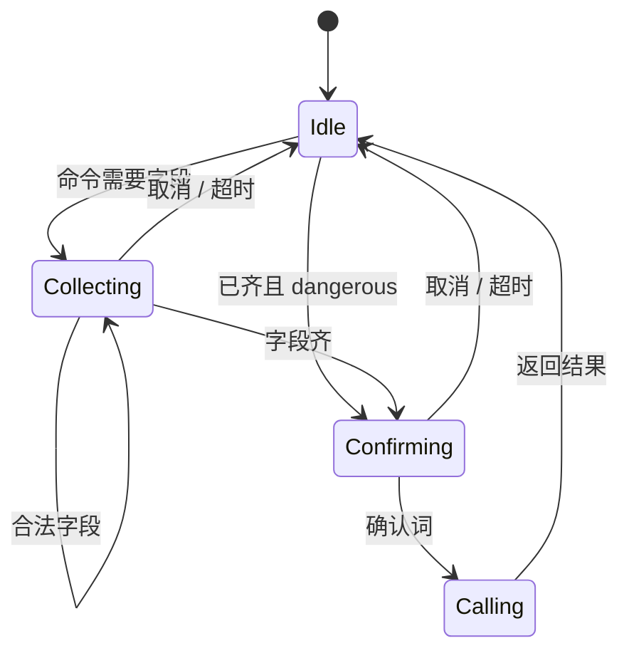

# AuthPro QQ 机器人命令与会话参考

| 项 | 值 |
| --- | --- |
| 文档状态 | 规范（与设计矩阵、集成契约同步） |
| 读者 | 插件作者、运营培训、验收 |
| 前缀 | `/` 或 `ap `（等价）。群聊须 `@机器人` 或群前缀 |
| 阶段 | 标了 P0 的命令是第一实现 PR 必做；其余先出现在 `/help` 的「即将开放」 |

命令只是会话入口。真正执行一律 `POST /api/bot/v1/invoke`（或 bind/unbind）。参数名与现网 JSON 一致。

---

## 1. 通用约定

### 1.1 确认词

| 场景 | 必须回复（120 秒内） | 取消 |
| --- | --- | --- |
| 开通授权 | `确认开通` | `取消` |
| 删除类 | `确认删除` | `取消` |
| 驳回 | `确认驳回` | `取消` |
| 解绑 | `确认解绑` | `取消` |
| 禁用/冻结 | `确认禁用` / `确认冻结` | `取消` |
| 上架/下架/弃用 | `确认上架` / `确认下架` / `确认弃用` | `取消` |

其它文本：若会话在收集字段则当作字段；若在等待确认则视为取消并提示。

### 1.2 输出脱敏

| 字段 | 群 | 私聊 |
| --- | --- | --- |
| JWT / 密码 / 商户 Key | 永不 | 永不 |
| 授权密钥、卡密、下载 URL、支付 URL | 不发，提示「已转私聊」或「请到面板查看」 | P0 默认「请到面板查看」；P1 可配置一次回显 |
| 邮箱 | `u***@d.com` | 可全文 |
| 应用 appKey | 可显示 | 可显示 |
| appSecret | 永不 | 永不（面板查看） |

### 1.3 谁能用

未绑定：仅 §2。绑定后按角色看对应章节。开发者命令出现的前提：`whoami.developer=true`。

---

## 2. 全员 / 未绑定

| 命令 | 阶段 | 通道 | 动作 ID | 说明 |
| --- | --- | --- | --- | --- |
| `/help` | P0 | 私/群 | session.help | 按身份打印可用命令 |
| `/bind` | P0 | **仅私** | session.bind | 进入绑定会话 |
| `/bind admin` `/bind agent` `/bind user` | P0 | 仅私 | session.bind | 跳过角色选择 |
| `/unbind` | P0 | 私 | session.unbind | 需确认解绑 |
| `/whoami` | P0 | 私/群 | session.whoami | 群内掩码账号 |
| `/actions` | P0 | 私 | session.actions | 机器可读动作列表的文本版 |

### 2.1 `/bind` 会话

```
用户: /bind
机器人: 绑定哪个身份？回复 admin / agent / user
用户: admin
机器人: 请发送管理员用户名
用户: root
机器人: 请发送密码（发送后建议在手机删除该条）
用户: ****
机器人: 已绑定管理员 root（R_ADMIN）。输入 /help 查看命令。
```

失败：不提示「用户不存在」，统一「账号或密码错误」。锁定：展示现网秒数。

群内 `/bind`：

```
请私聊我发送 /bind，不要在群里输入密码。
```

---

## 3. 管理员（`role=admin`）

### 3.1 P0

| 命令 | 动作 | 会话收集 | 映射 |
| --- | --- | --- | --- |
| `/license list [关键词]` | license.list | 可选 type/status/page | `GET /api/license/list` |
| `/license open` | license.create | 应用、套餐、类型、归属、域名（非 key） | `POST /api/license/create` |
| `/apps` | license.apps | | `GET /api/license/apps` |
| `/plans` | plan.list | 可选 appId | `GET /api/plan/list` |

`/license list` 群聊示例：

```
共 12 条，第 1/2 页
#88 演示应用 密钥 正常 用户张三 2027-01-01
#87 example.com 单域名 已禁用 代理华东
（不含密钥。翻页：/license list --page 2）
```

`/license open` 见设计文档 §6.3。预览后必须 `确认开通`。

### 3.2 P1 — 授权运维

| 命令 | 动作 | 备注 |
| --- | --- | --- |
| `/license query <账号或邮箱>` | license.query_user | |
| `/license update <id>` | license.update | 会话改到期 / 备注 / 目标 |
| `/license disable <id>` | license.toggle | 确认禁用 |
| `/license enable <id>` | license.toggle | `status=active` |
| `/license sites <id>` | license.sites | |
| `/license unbind-site <id> <siteId>` | license.site_unbind | 确认 |

### 3.3 P1 — 代理与用户

| 命令 | 动作 | 备注 |
| --- | --- | --- |
| `/agent list [关键词]` | agent.list | |
| `/agent add` | agent.create | 会话：名称、联系邮箱、密码、等级；密码不回显 |
| `/agent edit <id>` | agent.update | |
| `/agent freeze <id>` | agent.toggle | 确认冻结 |
| `/agent unfreeze <id>` | agent.toggle | |
| `/agent recharge <id> <金额>` | admin.agent.recharge | 确认；金额 >0 |
| `/user list [关键词]` | user.list | |
| `/user add` | user.create | 邮箱、昵称、密码 |
| `/user disable <id>` | user.toggle | 确认 |

禁止命令：`/su`、`/impersonate`、`/login-as`。帮助里写「代登录请用浏览器管理端」。

### 3.4 P1 — 工单

| 命令 | 动作 |
| --- | --- |
| `/ticket list [pending\|replied\|closed]` | ticket.list |
| `/ticket <id>` | ticket.detail |
| `/ticket reply <id>` 然后发送内容 | ticket.reply |
| `/ticket close <id>` | ticket.status action=close |
| `/ticket reopen <id>` | ticket.status action=reopen |
| `/ticket unread` | ticket.unread |

### 3.5 P1 — 开发者与广告

| 命令 | 动作 |
| --- | --- |
| `/dev apps` | src.app.list |
| `/dev approve <申请id>` | src.app.approve |
| `/dev reject <申请id>` | src.app.reject + 可选 note |
| `/dev cancel <申请id>` | src.app.freeze |
| `/dev list` | src.dev.list |
| `/dev freeze <开发者id>` | src.dev.freeze |
| `/src plugins` | 引导用 catalog 或管理端列表；审核用下列 |
| `/src approve plugin <id>` | src.plugin.approve |
| `/src reject plugin <id>` | src.plugin.reject |
| `/src shelf plugin <id>` | src.plugin.shelf |
| `/src unshelf plugin <id>` | src.plugin.unshelf |
| `/src deprecate plugin <id>` | src.plugin.deprecate |
| `/src approve template <id>` 等 | 模板对等 |
| `/ad list` | src.ad.list |
| `/ad add` | src.ad.upsert 会话 |
| `/ad del <id>` | src.ad.delete |
| `/ad apps` | src.ad.app.list |
| `/ad approve <id>` | src.ad.app.approve |
| `/ad reject <id>` | src.ad.app.reject |

### 3.6 P1 — 通知

| 命令 | 动作 |
| --- | --- |
| `/inbox` | notify.list tab=message |
| `/inbox notice` | notify.list tab=notice |
| `/todo` | notify.list tab=todo |
| `/inbox read <id>` | notify.read |
| `/inbox readall` | notify.read_all |

### 3.7 P2 — 其余管理命令

| 命令 | 动作 | 说明 |
| --- | --- | --- |
| `/license del <id>` | license.delete | 高危 |
| `/agent del <id>` | agent.delete | 高危 |
| `/user del <id>` | user.delete | 高危 |
| `/app list` `/app add` | app.list / app.create | 不回 secret |
| `/plan add` | plan.create | |
| `/card batch` | card.batch.create | 仅私聊 |
| `/promo` | promotion.* | |
| `/quota` | quota.* | |
| `/piracy` | piracy.* | |
| `/logs verify` | verify.log.list | |
| `/logs clear` | verify.log.clear | 高危 |
| `/dash` | dash.overview | 摘要数字 |
| `/src regen` | src.index.regen | |

不提供：`/config pay`、`/mail key`、`/update apply`、`/secret reset`。

---

## 4. 代理商（`role=agent`）

### 4.1 P0

| 命令 | 动作 |
| --- | --- |
| `/license list` | panel.license.list |
| `/help` `/whoami` | 会话 |

代理 **没有** `/license open`（那是管理端免费开通）。代理开通走 `/buy`（P1）。

### 4.2 P1

| 命令 | 动作 | 说明 |
| --- | --- | --- |
| `/buy` | purchase.create | 会话选应用/套餐/类型/归属用户/支付方式 |
| `/buy apps` | purchase.options | |
| `/order <orderNo>` | purchase.status | |
| `/balance` | finance.balance | |
| `/finance` | finance.overview | |
| `/license edit <id>` | panel.license.update | |
| `/license refresh <id>` | panel.license.refresh_key | 仅私聊确认 |
| `/redeem <卡密>` | panel.card.redeem | 仅私聊 |
| `/ticket new` | ticket.create | 分类+标题+内容 |
| `/ticket list` `/ticket <id>` `/ticket reply` `/ticket close` | 工单 | |
| `/dev apply` | dev.apply | 入驻 |
| `/dev status` | dev.apply_status | |
| `/inbox` `/todo` | 通知 | |

`/buy` 会话：

```
1. 选择应用
2. 选择套餐（展示折后价，数字来自现网购买接口，插件不自己算折扣）
3. 类型与域名
4. 可选归属用户（userId，0=代理自己）
5. 支付：balance / quota / 在线渠道
6. 预览金额 → 确认开通
```

在线支付：私聊给支付链接；群聊只说「请私聊查看支付链接」。

### 4.3 P2

`/recharge`、版本下载短链（仅私聊）、升级相关只读。

---

## 5. 开发者（代理已入驻或存量 developer）

| 命令 | 阶段 | 动作 | 说明 |
| --- | --- | --- | --- |
| `/dev me` | P1 | dev.me | |
| `/dev items` | P1 | dev.items | |
| `/dev submit plugin <id>` | P1 | dev.plugin.submit | 确认提交；不能指定 published |
| `/dev submit template <id>` | P2 | dev.template.submit | |
| `/dev ad new` | P1 | dev.ad.create | 标题、图 URL、https 链接、广告位 |
| `/dev ad list` | P1 | dev.ad.list | |
| `/dev draft plugin` | P2 | 草稿 upsert | 无 ZIP；只填元数据 URL |

上传 ZIP：回复「请打开 /developer-panel/plugins」。

---

## 6. 用户（`role=user`）

### 6.1 P0

`/license list` → `GET /api/user-panel/licenses`。

### 6.2 P1

| 命令 | 动作 | 说明 |
| --- | --- | --- |
| `/buy` | purchase.create | 若站点关闭自购，展示现网 403 文案 |
| `/balance` | finance.balance | |
| `/redeem` | panel.card.redeem | 仅私聊 |
| `/license target <id>` | panel.license.target | |
| `/license refresh <id>` | panel.license.refresh_key | 仅私聊 |
| `/ticket *` | 工单 | 与代理相同（走 user-panel 路径） |
| `/inbox` | 通知 | |

### 6.3 P2

`/upgrade` 开通代理商（`agent-upgrade` 订单）。`converted` 后必须 `/unbind` 再 `/bind agent`。

---

## 7. 会话状态机（插件）



同一 QQ 同时只允许一个会话。新命令覆盖旧会话并提示「已取消上一步」。

会话对象（插件内存，不落盘）：

```json
{
  "qq": "123",
  "action": "license.create",
  "params": {},
  "step": "owner",
  "startedAt": 0,
  "confirmDeadline": 0
}
```

密码字段禁止写入该对象的持久化快照；仅存在于当前函数栈。

---

## 8. 群 vs 私聊速查

| 命令族 | 群 | 私聊 |
| --- | --- | --- |
| bind / 密码 / redeem / refresh_key / 支付链 | 拒 | 可 |
| license open 结果 | 提示已处理 | 可看 id，默认无密钥 |
| list / whoami / help / ticket list | 可 | 可 |
| 管理写（开授权、审开发者、加款） | 仅当群号在 `admin_group_ids` | 可 |
| 未绑定闲聊 | 忽略或短提示 | 提示 /bind |

---

## 9. 验收话术（给测试）

P0 脚本：

1. 未绑定群里发 `/license open` → 不执行开通。
2. 私聊 `/bind admin` 成功 → `/whoami` 显示管理员。
3. `/license open` 走完确认 → 面板授权列表多一条，`source` 为 admin。
4. `/unbind` 后同一 QQ 无法再 list 管理端数据。
5. 换代理账号绑定 → `/license open` 被拒。
6. 全程抓包 / 日志搜索 `eyJ`（JWT 头）应为 0（除服务端加密存储外）。

P1 加测：代理 `/buy` 余额不足时 `msg` 与面板相同；管理员 `/dev approve` 后面板入驻列表消失且开发者可 `/dev me`。

---

## 10. 命令别名（可选，插件实现）

| 主命令 | 别名 |
| --- | --- |
| `/license open` | `/开授权` `/开通授权` |
| `/license list` | `/授权列表` |
| `/agent add` | `/加代理` |
| `/bind` | `/绑定` |
| `/whoami` | `/我是谁` |
| `/help` | `/帮助` |

中文别名不得降低鉴权。P0 英文主命令必须可用；中文别名 P1。

---

## 11. 变更记录

| 日期 | 变更 |
| --- | --- |
| 2026-09-20 | 首版命令参考，覆盖全角色与 P0–P2 |
