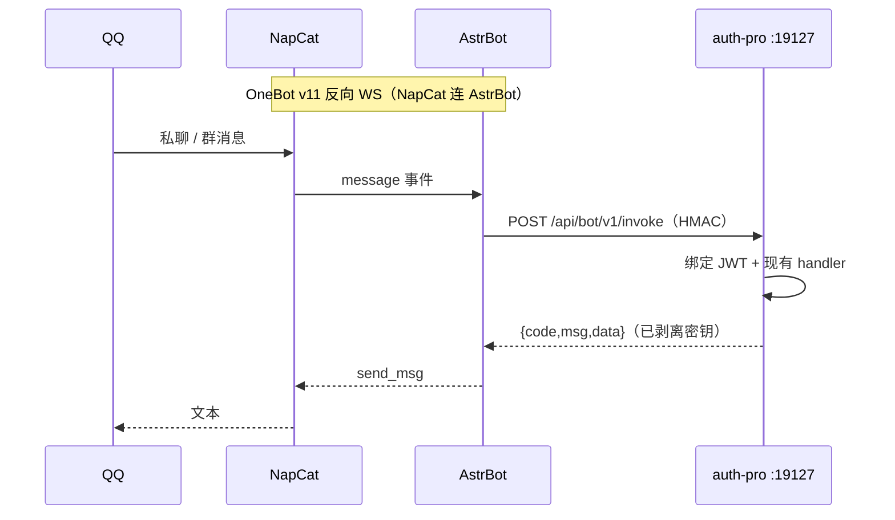
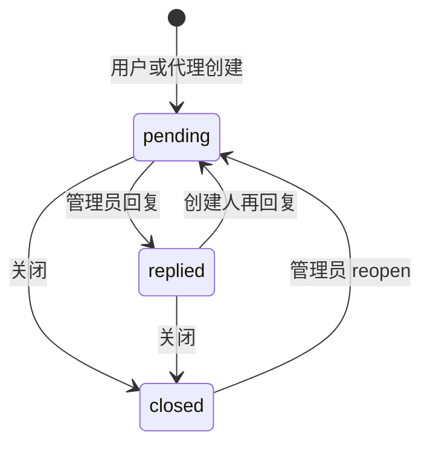
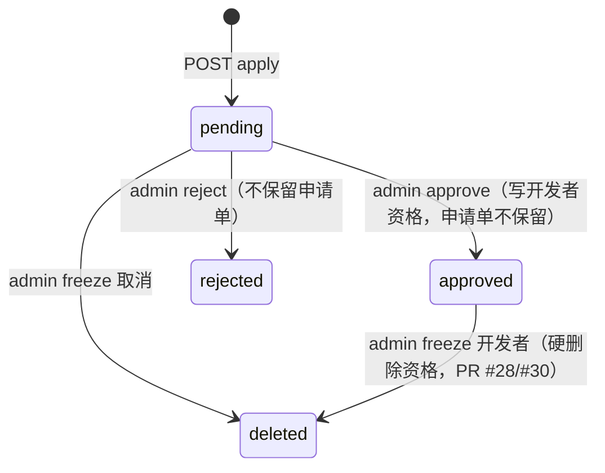
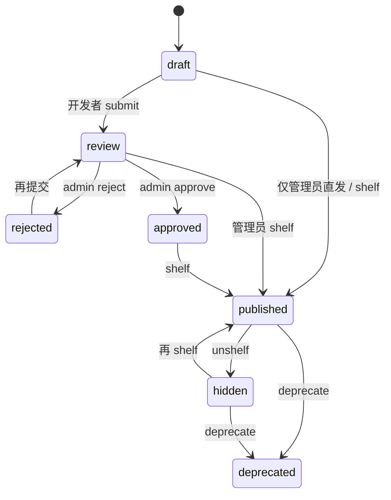

# AuthPro QQ 机器人开发集成规范

| 项 | 值 |
| --- | --- |
| 文档状态 | **规范（实现对照本文件，不得臆造字段）** |
| 读者 | 后端、AstrBot 插件、运维 |
| 配套 | [产品 / 架构设计](../design/qq-bot-operations.md)、[命令参考](./qq-bot-command-reference.md) |
| 对照代码 | master `backend/main.go`、`backend/middleware/jwt.go`、`backend/handler/*.go`（`@ae37504`） |

本文给出 **可编码的契约**。未写进本文的路径、字段、状态值，实现时视为不存在。业务规则以现有 handler 为准；本文只规定通道、绑定、映射与安全。

---

## 1. 读者与前置

实现者需要：

- 能编译运行 auth-pro（Go 1.22，默认 `PORT=19127`）；
- 已安装站点（`install.lock` + `db.json`）；
- 了解现网响应包：`{ "code": number, "msg": string, "data": any }`，HTTP 多为 200；
- 不把本文当成「再做一套开通授权 API」。

推荐阅读顺序：设计文档 §3–§5 → 本文 §4–§8 → 命令参考。

---

## 2. 组件与连接

### 2.1 运行时拓扑



### 2.2 OneBot v11（NapCat）

锁定：**反向 WebSocket**。AstrBot 开 OneBot v11 适配器服务端，NapCat 作为客户端连入。

NapCat 侧（概念配置，键名以你安装的 NapCat 版本 UI 为准）：

| 项 | 值 |
| --- | --- |
| 协议 | OneBot v11 |
| 模式 | 反向 WS |
| URL | `ws://127.0.0.1:<AstrBot_OneBot端口>/`（路径以 AstrBot 适配器说明为准，常见 `/ws`） |
| Token | 与 AstrBot 适配器 `Access Token` 一致，**不要留空** |
| 上报 | message、bot 自身消息过滤开启 |

AstrBot 侧：

| 项 | 值 |
| --- | --- |
| 平台 | `aiocqhttp` / OneBot v11（以 AstrBot 当前稳定版名为准） |
| 反向 WS 监听 | `127.0.0.1`，禁止 `0.0.0.0` 对公网 |
| 插件 | 后续仓库目录 `integrations/astrbot-authpro/`（本轮不落地代码） |

官方能力以 [AstrBot 文档](https://docs.astrbot.app/) 与 NapCat 发行说明为准；若端口不一致，以本机适配器页显示为准，并写入 `system_configs.bot.napcat_ws_note`。

### 2.3 插件安装（实现阶段）

```text
integrations/astrbot-authpro/
  metadata.yaml          # 插件元数据
  main.py                # 命令入口
  authpro_client.py      # HMAC 客户端
  README.md
```

拷贝到 AstrBot `plugins/authpro/` 后重启。环境变量或插件配置：

| 键 | 必填 | 说明 |
| --- | --- | --- |
| `AUTHPRO_BASE_URL` | 是 | 例 `http://127.0.0.1:19127`，不要末尾斜杠 |
| `AUTHPRO_BOT_SECRET` | 是 | 与超管写入的 `bot.shared_secret` 完全一致 |
| `AUTHPRO_TIMEOUT_SEC` | 否 | 默认 15 |
| `COMMAND_PREFIX` | 否 | 默认 `/`，可兼 `ap ` |

插件 **禁止** 配置任何用户 JWT。

---

## 3. 通用 HTTP 约定

### 3.1 基路径

实现阶段注册：

```text
/api/bot/v1
```

在 `backend/main.go` 的 `api := r.Group("/api")` 内增加分组，中间件 **不是** `JWTAuth`，而是 Bot HMAC。安装未完成（无 DB）时全部 500「系统未配置」。

### 3.2 鉴权头（AstrBot → auth-pro）

| Header | 必填 | 说明 |
| --- | --- | --- |
| `X-AuthPro-Bot-Timestamp` | 是 | Unix 秒 |
| `X-AuthPro-Bot-Nonce` | 是 | 16–64 位随机 hex，5 分钟内不可复用 |
| `X-AuthPro-Bot-Signature` | 是 | 小写 hex(HMAC-SHA256) |
| `Content-Type` | POST 是 | `application/json` |
| `X-AuthPro-QQ` | invoke/whoami/unbind/actions 是 | 发送者 `user_id` 数字字符串 |
| `X-AuthPro-Chat` | 建议 | `private` 或 `group` |
| `X-AuthPro-Group` | 群聊是 | 群号 |

**不使用** `Authorization: Bearer <jwt>` 调用 `/api/bot/*`。

### 3.3 签名串

```text
canonical = timestamp + "\n" + nonce + "\n" + METHOD + "\n" + PATH + "\n" + sha256_hex(body)
signature = HMAC_SHA256(shared_secret, canonical)  → hex 小写
```

- `PATH` 为 URL 路径，不含 query，例 `/api/bot/v1/invoke`。
- GET 的 `body` 视为空字符串，`sha256_hex("")` 为 `e3b0c44298fc1c149afbf4c8996fb92427ae41e4649b934ca495991b7852b855`。
- `timestamp` 与服务器差超过 300 秒 → `code=401`「签名已过期」。
- nonce 重复 → `code=401`「重复请求」。
- 签名错 → `code=401`「机器人签名无效」。
- `bot.enabled!=1` → `code=403`「QQ 机器人未启用」。
- `shared_secret` 为空 → `code=403`「未配置机器人密钥」。

`shared_secret` 至少 32 字节熵；超管 UI 只写不读。

### 3.4 统一响应

```json
{
  "code": 200,
  "msg": "",
  "data": {}
}
```

网关在转发业务 handler 后执行 **剥离器**（见 §9），再返回给 AstrBot。

现网业务码沿用：200 / 400 / 401 / 403 / 404 / 410 / 429 / 500。字段名现网混用 `message` 与 `msg`（例如 `middleware.JWTAuth` 用 `message`）。网关对外 **统一 `msg`**：若内部 JSON 只有 `message`，拷贝到 `msg`。

---

## 4. 网关 API 契约

以下端点 **尚不存在于仓库**，实现时必须按本形状新增。它们不包含业务 SQL。

### 4.1 `GET /api/bot/v1/health`

验签可选实现为：**仍要 HMAC**（避免探测）。

响应 `data`：

```json
{
  "enabled": true,
  "allowedRoles": ["admin", "agent", "user"],
  "allowGroup": true,
  "version": "与 config.AppVersion 相同"
}
```

不含密钥。

### 4.2 `POST /api/bot/v1/bind`

仅私聊。`X-AuthPro-Chat` 必须为 `private`，否则 403「请在私聊绑定」。

请求：

```json
{
  "role": "admin",
  "username": "string",
  "password": "string"
}
```

| 字段 | 规则 |
| --- | --- |
| role | `admin` \| `agent` \| `user`；P1 可加存量 `developer`。必须 ∈ `bot.allowed_roles` |
| username | admin=管理员用户名；agent=邮箱或 contact；user=邮箱 / 手机 / 数字 ID（与 `UserLogin` 识别规则相同） |
| password | 明文一次传输；服务端不落库、不写 info 日志 |

处理步骤（规范顺序）：

1. HMAC 通过且 `enabled=1`。
2. `LoginLockRemaining(clientIP, username)`；锁定则 `code=429`，文案与现网一致。
3. 按 role 执行与现网相同的 SQL + bcrypt（从 `handler.Login` / `AgentPanelLogin` / `UserLogin` **抽出校验函数并复用**，禁止复制一份不同的 SQL）。
4. 失败：`RecordLoginFailure`，返回 `401`「账号或密码错误」（不暴露是用户名还是密码）。
5. 成功：`RecordLoginSuccess`；按现网规则签发 JWT（TTL：admin 24h + refresh 7d；agent/user 7d）。
6. UPSERT `qq_bot_bindings`；若该 `account_id+role` 已绑其它 QQ，旧行 `revoked_at=now`。
7. 响应 **禁止** 出现 token 字段。

成功 `data`：

```json
{
  "qqUin": "123456789",
  "role": "admin",
  "roleCode": "R_ADMIN",
  "accountId": 1,
  "username": "admin",
  "displayName": "admin",
  "capabilitiesHint": ["license.create", "license.list"]
}
```

`developer` 主角色仅存量独立账号。新客户：`role=agent` 绑定后 `whoami.data.developer=true`。

用户 `converted`：`401`，`msg` 与现网「该账号已升级为代理，请前往代理端登录」一致，`data.converted=true`。

### 4.3 `POST /api/bot/v1/unbind`

请求体可空 `{}`。需 `X-AuthPro-QQ`。建议插件先走确认会话。

成功：`{"code":200,"msg":"已解绑","data":{"qqUin":"..."}}`。无绑定：`404`「未绑定」。

### 4.4 `GET /api/bot/v1/whoami`

成功 `data`：

```json
{
  "bound": true,
  "qqUin": "123456789",
  "role": "agent",
  "roleCode": "",
  "accountId": 9,
  "username": "agent@example.com",
  "displayName": "华东代理",
  "developer": true,
  "developerStatus": "approved",
  "tokenExpiresAt": "2026-09-27T15:00:00Z",
  "needsRebind": false
}
```

未绑定：`code=200`，`data.bound=false`（便于插件区分 401 签名失败）。`needsRebind=true` 当 token 过期或密码已刷新。

`developer` / `developerStatus`：对 `role=agent` 调用现有 `GetDeveloperByAgentID` / 申请状态，不新写资格逻辑。

### 4.5 `GET /api/bot/v1/actions`

返回当前 QQ 允许的动作 ID 列表（未绑定仅 `session.help`、`session.bind`）。

```json
{
  "code": 200,
  "msg": "",
  "data": {
    "role": "admin",
    "phase": ["P0", "P1", "P2"],
    "actions": [
      {
        "id": "license.create",
        "phase": "P0",
        "dangerous": true,
        "privateOnly": true,
        "confirm": true,
        "mappedMethod": "POST",
        "mappedPath": "/api/license/create"
      }
    ]
  }
}
```

`phase` 查询参数可过滤：`GET /api/bot/v1/actions?phase=P0`。实现时用配置或常量 `BOT_IMPLEMENTED_PHASES`，未实现的动作不要标为可用。**设计矩阵里有但未实现的动作不得出现在列表中。**

### 4.6 `POST /api/bot/v1/invoke`

请求：

```json
{
  "action": "license.create",
  "params": {},
  "confirmToken": "",
  "idempotencyKey": ""
}
```

| 字段 | 规则 |
| --- | --- |
| action | 动作 ID，必须在该身份已实现目录中 |
| params | 映射到现有 handler 的 JSON **字段名与现网完全一致**（如 `appId` 不是 `app_id`） |
| confirmToken | `dangerous=true` 时必填，值为 `POST /api/bot/v1/confirm` 返回的 token |
| idempotencyKey | 可选，64 字内；相同 key 10 分钟内返回首次结果，防 QQ 重发 |

处理：

1. 验签、限流、绑定存在、`needsRebind=false`。
2. `allowed_roles` 包含绑定角色。
3. 动作对角色合法；`privateOnly` 且群聊 → 403「请私聊操作」。
4. 管理写操作在群聊：群号必须 ∈ `admin_group_ids`（若配置非空）。
5. `R_SUPER` 专属现网接口不在目录中，不可 invoke。
6. 将存储的 JWT 解析为 `middleware.Claims`，写入 gin context：`user_id` `username` `role` `role_code` `token_issued_at`（与 `JWTAuth` 相同）。
7. 再执行与该路由相同的后续中间件语义：`RequireAdmin` / `RequireFreshPassword("admins"|"agents"|"users")` / `RequireActiveUser` / `RequireDeveloper`。
8. 调用 **同一个** handler 函数（例如 `handler.LicenseCreate`），用 `params` 作为 Body。
9. 剥离密钥字段，写审计，返回。

路径参数：`params` 内用 `_path` 对象，例如 `{"_path":{"id":"88"},"status":"disabled"}` 对应 `PUT /api/license/:id/toggle`。query 用 `_query`。

禁止 invoke 把 `action` 当成任意 URL 代理（开放代理）。`mappedPath` 必须来自服务端白名单表。

### 4.7 `POST /api/bot/v1/confirm`

为破坏性动作签发一次性确认票。

请求：

```json
{
  "action": "license.create",
  "params": { "appId": 1, "planId": 3, "type": "key", "ownerType": "user", "ownerId": 12 },
  "previewOnly": true
}
```

响应：

```json
{
  "code": 200,
  "msg": "",
  "data": {
    "confirmToken": "ulid-or-random",
    "expiresIn": 120,
    "preview": {
      "action": "license.create",
      "summary": "开通授权：appId=1 planId=3 type=key owner=user:12"
    }
  }
}
```

票使用一次即废。过期或不匹配 params 哈希 → invoke `400`「请重新确认」。

P0 插件可用「会话内确认」而不调 confirm API，但 **网关仍必须** 对 `dangerous=true` 要 `confirmToken`，避免插件被绕过。允许插件在用户回复「确认开通」后先 `confirm` 再 `invoke`。

---

## 5. 动作 → 现有路由映射（完整表）

实现时把本表做成 `bot_actions.go` 常量。`params` 列只列 Body/Query 要点；完整字段以 handler 结构体为准。

### 5.1 会话（网关自身）

| action | method | path | params |
| --- | --- | --- | --- |
| session.bind | POST | `/api/bot/v1/bind` | 见 §4.2 |
| session.unbind | POST | `/api/bot/v1/unbind` | `{}` |
| session.whoami | GET | `/api/bot/v1/whoami` | |
| session.actions | GET | `/api/bot/v1/actions` | query `phase` |

### 5.2 管理端授权 — 对照 `backend/handler/license.go`

`POST /api/license/create` Body（现网）：

```json
{
  "appId": 1,
  "planId": 3,
  "type": "domain",
  "ownerType": "user",
  "ownerId": 12,
  "domain": "example.com",
  "remark": ""
}
```

`type` 枚举：`domain` \| `wildcard` \| `ip` \| `key`。`key` 时 `domain` 可空。成功 `data.id`。

`GET /api/license/list` Query：`keyword` `type` `status` `appId` `page` `pageSize`（默认 10，最大 100）。`status=disabled` 现网会查 `revoked`。

`PUT /api/license/:id` Body：`appId` `type` `domain` `expireAt` `remark`。`expireAt` 支持 `2006-01-02T15:04:05.000Z` / `2006-01-02 15:04:05` / `2006-01-02 15:04`。

`PUT /api/license/:id/toggle` Body：`{"status":"disabled"}` 或 `"active"`。现网把 `disabled` 写成 `revoked`。

| action | method | path |
| --- | --- | --- |
| license.list | GET | `/api/license/list` |
| license.query_user | GET | `/api/license/query-by-user?account=` |
| license.create | POST | `/api/license/create` |
| license.update | PUT | `/api/license/:id` |
| license.toggle | PUT | `/api/license/:id/toggle` |
| license.delete | DELETE | `/api/license/:id` |
| license.sites | GET | `/api/license/:id/sites` |
| license.site_unbind | DELETE | `/api/license/:id/sites/:siteId` |
| license.dashboard | GET | `/api/license/dashboard` |
| license.owners | GET | `/api/license/owners` |
| license.apps | GET | `/api/license/apps` |

### 5.3 代理端授权 / 购买 — `agent_panel.go`

`POST /api/agent-panel/purchase`：

```json
{
  "appId": 1,
  "planId": 3,
  "userId": 0,
  "type": "key",
  "domain": "",
  "payMethod": "balance"
}
```

`payMethod`：空或 `balance` / `quota` 走余额额度；其它走在线支付（`parseOnlinePaySelection`）。

| action | method | path |
| --- | --- | --- |
| panel.license.list | GET | `/api/agent-panel/licenses` |
| panel.license.update | PUT | `/api/agent-panel/licenses/:id` |
| panel.license.refresh_key | POST | `/api/agent-panel/licenses/:id/refresh-key` |
| panel.license.sites | GET | `/api/agent-panel/licenses/:id/sites` |
| panel.license.site_unbind | DELETE | `/api/agent-panel/licenses/:id/sites/:siteId` |
| panel.card.redeem | POST | `/api/agent-panel/cards/redeem` Body `{"cardCode":"..."}` |
| purchase.options | GET | `/api/agent-panel/apps/purchase` |
| purchase.create | POST | `/api/agent-panel/purchase` |
| purchase.pay_options | GET | `/api/agent-panel/purchase/pay-options` |
| purchase.status | GET | `/api/agent-panel/purchase/orders/:orderNo` |
| finance.overview | GET | `/api/agent-panel/finance/overview` |
| finance.balance | GET | `/api/agent-panel/balance` |
| recharge.options | GET | `/api/agent-panel/recharge/options` |
| recharge.create | POST | `/api/agent-panel/recharge/orders` |
| recharge.status | GET | `/api/agent-panel/recharge/orders/:orderNo` |
| agent.profile | GET | `/api/agent-panel/profile` |
| agent.stats | GET | `/api/agent-panel/dashboard/stats` |

### 5.4 用户端 — `user_panel.go` / `user_panel_auth.go`

`POST /api/user-panel/purchase`：

```json
{
  "appId": 1,
  "planId": 3,
  "type": "domain",
  "domain": "a.example.com",
  "payMethod": "balance"
}
```

自购关闭时现网 `403`「用户自助购买已关闭，请联系管理员」。

| action | method | path |
| --- | --- | --- |
| panel.license.list | GET | `/api/user-panel/licenses` |
| panel.license.target | PUT | `/api/user-panel/licenses/:id/target` |
| panel.license.refresh_key | POST | `/api/user-panel/licenses/:id/refresh-key` |
| panel.card.redeem | POST | `/api/user-panel/cards/redeem` `{"cardCode"}` |
| purchase.options | GET | `/api/user-panel/apps/purchase` |
| purchase.create | POST | `/api/user-panel/purchase` |
| purchase.pay_options | GET | `/api/user-panel/purchase/pay-options` |
| purchase.status | GET | `/api/user-panel/purchase/orders/:orderNo` |
| finance.balance | GET | `/api/user-panel/balance` |
| user.dashboard | GET | `/api/user-panel/dashboard` |
| user.profile | GET | `/api/user-panel/profile` |
| upgrade.levels | GET | `/api/user-panel/agent-upgrade/levels` |
| upgrade.order | POST | `/api/user-panel/agent-upgrade/orders` |
| upgrade.status | GET | `/api/user-panel/agent-upgrade/orders/:orderNo` |
| upgrade.cancel | DELETE | `/api/user-panel/agent-upgrade/orders/:orderNo` |

用户与代理的 `panel.license.list` 同名：invoke 根据绑定 role 选路径。

### 5.5 管理端代理 / 用户 — `agent.go` `user_manage.go`

`POST /api/agent/create`：

```json
{
  "name": "华东",
  "contact": "agent@example.com",
  "password": "once-only",
  "level": "bronze",
  "discount": 0,
  "remark": ""
}
```

`level` 空则现网默认 `bronze`。`contact` 同时写入 `email`。响应只有 `data.id`，无密码。

`POST /api/agent/:id/recharge`：`{"amount":100,"remark":""}`，`amount>0`。

`POST /api/user/create`：`{"email","nickname","password","balance?"}`，密码最少 6 位。

| action | method | path |
| --- | --- | --- |
| agent.list | GET | `/api/agent/list` query `keyword` `level` `status` `source` `page` `pageSize` |
| agent.create | POST | `/api/agent/create` |
| agent.update | PUT | `/api/agent/:id` |
| agent.toggle | PUT | `/api/agent/:id/toggle` `{"status":"frozen"\|"active"}`（以实现代码为准） |
| agent.delete | DELETE | `/api/agent/:id` |
| admin.agent.recharge | POST | `/api/agent/:id/recharge` |
| agent.levels | GET | `/api/agent-level/list` |
| user.list | GET | `/api/user/list` |
| user.create | POST | `/api/user/create` |
| user.update | PUT | `/api/user/:id` |
| user.toggle | PUT | `/api/user/:id/toggle` |
| user.delete | DELETE | `/api/user/:id` |

`impersonate` **不要加入映射表**。

### 5.6 工单 — `ticket.go`

创建（用户/代理）：

```json
{ "category": "authorization", "title": "无法验证", "content": "域名已解析..." }
```

`category` 非法时现网回落 `other`。管理员改状态：`{"action":"close"}` 或 `"reopen"`。

| action | role | method | path |
| --- | --- | --- | --- |
| ticket.create | user/agent | POST | `/api/user-panel/tickets` 或 `/api/agent-panel/tickets` |
| ticket.list | user/agent | GET | 同上 `/tickets` |
| ticket.detail | user/agent | GET | `/tickets/:id` |
| ticket.reply | user/agent | POST | `/tickets/:id/replies` `{"content"}` |
| ticket.close | user/agent | PUT | `/tickets/:id/close` |
| ticket.list | admin | GET | `/api/ticket/list` |
| ticket.detail | admin | GET | `/api/ticket/:id` |
| ticket.reply | admin | POST | `/api/ticket/:id/reply` |
| ticket.status | admin | PUT | `/api/ticket/:id/status` |
| ticket.unread | * | GET | 各端 `unread-count` |

### 5.7 源站 — `source_station.go` 已注册路由

开发者申请：`POST /api/v1/source/developer/apply` Body `{}`（身份来自 JWT）。未带 Authorization 的旧接口现网 **410**。

广告申请：

```json
{
  "appId": 1,
  "title": "春季活动",
  "imageUrl": "https://...",
  "linkUrl": "https://...",
  "positions": ["home-banner"],
  "note": ""
}
```

`positions` 白名单与现网广告位一致：`home-banner` `sidebar` `popup`。

管理端 upsert 广告：字段见 `advertisementRecord`：`id` `title` `imageUrl` `destinationUrl` `position`/`positions` `weight` `startAt` `endAt` `description`。跳转必须 `https://`。

| action | method | path |
| --- | --- | --- |
| dev.apply | POST | `/api/v1/source/developer/apply` |
| dev.apply_status | GET | `/api/v1/source/developer/apply/status` |
| dev.me | GET | `/api/v1/source/developer/me` |
| dev.items | GET | `/api/v1/source/developer/items` |
| dev.plugin.submit | POST | `/api/v1/source/developer/plugins/:id/submit` |
| dev.template.submit | POST | `/api/v1/source/developer/templates/:id/submit` |
| dev.ad.create | POST | `/api/v1/source/developer/ad-applications` |
| dev.ad.list | GET | `/api/v1/source/developer/ad-applications` |
| src.app.list | GET | `/api/v1/source/admin/applications` |
| src.app.approve | POST | `/api/v1/source/admin/applications/:id/approve` |
| src.app.reject | POST | `/api/v1/source/admin/applications/:id/reject` |
| src.app.freeze | POST | `/api/v1/source/admin/applications/:id/freeze` |
| src.dev.list | GET | `/api/v1/source/admin/developers` |
| src.dev.freeze | POST | `/api/v1/source/admin/developers/:id/freeze` |
| src.plugin.approve | POST | `/api/v1/source/admin/plugins/:id/approve` |
| src.plugin.reject | POST | `/api/v1/source/admin/plugins/:id/reject` |
| src.plugin.shelf | POST | `/api/v1/source/admin/plugins/:id/shelf` |
| src.plugin.unshelf | POST | `/api/v1/source/admin/plugins/:id/unshelf` |
| src.plugin.deprecate | POST | `/api/v1/source/admin/plugins/:id/deprecate` |
| src.template.* | POST | `/api/v1/source/admin/templates/:id/{approve,reject,shelf,unshelf,deprecate}` |
| src.ad.list | GET | `/api/v1/source/admin/advertisements` |
| src.ad.upsert | PUT | `/api/v1/source/admin/advertisements` |
| src.ad.delete | DELETE | `/api/v1/source/admin/advertisements/:id` |
| src.ad.app.list | GET | `/api/v1/source/admin/ad-applications` |
| src.ad.app.approve | POST | `/api/v1/source/admin/ad-applications/:id/approve` |
| src.ad.app.reject | POST | `/api/v1/source/admin/ad-applications/:id/reject` |
| src.index.regen | POST | `/api/v1/source/admin/index/regenerate` |

开发者 upsert 草稿字段见 `sourcePluginDraftRequest` / `sourceTemplateDraftRequest`（`id` `appId` `category` `name` …）。**机器人若转发这些请求，必须忽略客户端传入的 `shelf=true`（开发者）**，与企业设计「开发者必审」一致。

### 5.8 应用 / 套餐 / 卡密

`POST /api/app/create`：`{"name","enabled","remark","purchaseLicenseTypes":["domain","key"]}`。响应若含 `appSecret`，剥离器删除。

`POST /api/plan/create`：`appId` `name` `licenseType` `durationDays` `price` `maxSites` `sort` `enabled` `remark`。

`POST /api/license/cards/batches`：`appId` `planId` `type` `quantity` `remark`。

| action | method | path |
| --- | --- | --- |
| app.list | GET | `/api/app/list` |
| app.create | POST | `/api/app/create` |
| plan.list | GET | `/api/plan/list` |
| plan.create | POST | `/api/plan/create` |
| card.batch.create | POST | `/api/license/cards/batches` |
| card.batch.list | GET | `/api/license/cards/batches` |

### 5.9 通知 — `RegisterNotificationRoutes`

| action | method | path |
| --- | --- | --- |
| notify.list | GET | `/api/v1/notifications?tab=notice\|message\|todo` |
| notify.unread | GET | `/api/v1/notifications/unread-count` |
| notify.read | POST | `/api/v1/notifications/:id/read` |
| notify.read_all | POST | `/api/v1/notifications/read-all` |

JWT 角色 admin/agent/user/developer 现网均支持。绑定为 agent 且已入驻时，可按现网 `currentNotificationRecipient` 逻辑读到开发者收件箱。

### 5.10 反盗版 / 仪表盘（P2）

路径与 `main.go` 一致，动作 ID 用点号：

- `GET /api/piracy/tracking/list` → `piracy.tracking.list`
- `PUT /api/piracy/tracking/:id/block` → `piracy.tracking.block`
- `GET /api/piracy/alert/list` → `piracy.alert.list`
- `GET /api/piracy/blacklist/list` → `piracy.blacklist.list`
- `POST /api/piracy/blacklist/create` → `piracy.blacklist.create`
- `GET /api/verify-log/list` → `verify.log.list`
- `DELETE /api/verify-log/clear` → `verify.log.clear`（dangerous）
- `GET /api/dashboard/overview` → `dash.overview`

### 5.11 禁止映射（实现时加负向测试）

```
POST /api/auth/login
POST /api/agent-panel/login
POST /api/user-panel/login
POST /api/v1/source/developer/login     （除非存量 developer bind）
POST /api/user/:id/impersonate
POST /api/agent/:id/impersonate
PUT  /api/system/config
PUT  /api/system/payment-config
PUT  /api/system/payment-v2-config
PUT  /api/system/mail-config
PUT  /api/system/realname-config
POST /api/system/update/apply
PUT  /api/app/:id/reset-secret
POST /api/license/verify
POST /api/install/*
ANY  /api/payment/easypay*
```

---

## 6. 现有状态机（机器人必须原样遵守）

### 6.1 授权状态

线协议：`active` / `expired` / `revoked`。列表 API 把 `revoked` 输出为 `disabled`。toggle 入参用 `disabled`/`active`。

### 6.2 工单



### 6.3 开发者入驻



### 6.4 目录项



公开 `GET /software-source/{app_key}/index.json` 只含 `published`。机器人不得宣称「已上架」除非 handler 返回的状态就是 `published`。

### 6.5 广告申请

`pending` → `approved`（生成投放记录） / `rejected`。已审不可再审（现网 `errAdApplicationReviewed`）。

---

## 7. 配置读写（实现阶段）

在 `ensureSystemConfigStorage` 的 INSERT 列表增加 `group='bot'` 的键（§ 设计 8.3）。

超管读取 `GET /api/system/config` 的响应对象 **扩展** 字段（不要新开独立资源，除非现有文件已不可读）：

```json
{
  "botEnabled": false,
  "botAllowedRoles": ["admin"],
  "botAllowGroup": true,
  "botAdminGroupIds": "",
  "botRateLimitPerMin": 20,
  "botAstrbotBaseUrl": "",
  "botNapcatWsNote": "",
  "botSharedSecretSet": false
}
```

更新走现有 `PUT /api/system/config` 扩字段，或 `PUT /api/system/config/switch/bot_enabled` 仅开关。密钥字段空=不修改。

**本轮不改前端。** 实现配置 API 时再加 Tab。

---

## 8. AstrBot 插件行为规范

1. 收到消息后解析发送者 `user_id`，所有 API 带 `X-AuthPro-QQ`。
2. 不把完整事件日志（含密码）打到 stdout；绑定会话使用内存 dict，120s TTL，结束 `password=None`。
3. `code!=200` 原样展示 `msg`。
4. 群聊渲染调用统一 `mask()`。
5. 不实现本地命令「直接 SQL」。
6. 文件上传类命令回复面板路径，不在 QQ 收 ZIP。
7. 帮助文本按 `GET /actions?phase=` 动态生成，避免插件写死过期命令。

伪代码（规范，非本轮交付）：

```python
def on_bind_password(uin, role, username, password):
    body = {"role": role, "username": username, "password": password}
    resp = hmac_post("/api/bot/v1/bind", body, qq=uin, chat="private")
    password = None
    return render_whoami(resp)
```

---

## 9. 剥离器（网关强制）

对 invoke / bind 响应 JSON 递归删除键（大小写不敏感）：

```
token, refreshToken, refresh_token, accessToken, access_token,
password, passwordHash, password_hash,
appSecret, app_secret,
easypayMerchantKey, easypay_key, geetestCaptchaKey, geetest_captcha_key,
smtpPassword, smtp_password
```

对 `licenseKey` / `license_key` / `cardCode`：若 `X-AuthPro-Chat=group` 则删除；私聊默认删除，仅当动作在白名单 `ALLOW_SECRET_REVEAL` 且配置允许时保留。P0 该白名单为空。

---

## 10. 错误码（通道层）

业务层错误透传。通道层固定文案：

| code | msg |
| --- | --- |
| 401 | 机器人签名无效 |
| 401 | 签名已过期 |
| 401 | 重复请求 |
| 401 | 账号或密码错误 |
| 401 | 绑定已失效，请重新 /bind |
| 403 | QQ 机器人未启用 |
| 403 | 未配置机器人密钥 |
| 403 | 请在私聊绑定 |
| 403 | 请私聊操作 |
| 403 | 当前角色未开放此动作 |
| 403 | 该群未授权管理操作 |
| 403 | 无权限访问 / 无权限访问代理商接口 / 无权限访问开发者接口 / 无权限访问用户端（现网中间件原文） |
| 404 | 未绑定 |
| 429 | 操作过于频繁，请稍后再试 |
| 429 | 登录尝试次数过多，请 N 秒后重试（复用现网） |

---

## 11. 宝塔部署步骤（运维可执行）

### 11.1 auth-pro

1. 按仓库 README 用宝塔反代 `https://授权域名` → `127.0.0.1:19127`。
2. 环境变量建议 `HOST=127.0.0.1`。
3. 超管稍后在系统设置写入机器人密钥并 `enabled=1`（实现后）。未实现前不要对公网开放不存在的 `/api/bot`。

### 11.2 NapCat（Linux 宝塔）

1. 使用 NapCat 官方 Linux / Docker 安装方式；QQ 登录扫码。
2. 在 OneBot 配置填 AstrBot 反向 WS。
3. 宝塔「安全」不要放行 NapCat 端口。
4. 用 systemd 或「进程守护」保活。

### 11.3 AstrBot

1. 官方安装（Python / Docker）。WebUI 只绑 `127.0.0.1`，需要时走 SSH 隧道。
2. 启用 OneBot v11 适配器，Access Token 与 NapCat 一致。
3. 放入 `authpro` 插件，配置 `AUTHPRO_BASE_URL=http://127.0.0.1:19127`。
4. 用小号私聊 `/help`，确认链路。

### 11.4 联调检查单

- [ ] NapCat 状态在线，AstrBot 日志有 `connected`
- [ ] 未配置 HMAC 时 curl `/api/bot/v1/health` 失败
- [ ] 正确 HMAC 且未启用 → 403 未启用
- [ ] 启用后私聊绑定管理员成功，响应无 token
- [ ] 群聊发送密码被拒
- [ ] 绑定代理后 `/license open`（管理端开通）→ 403
- [ ] 绑定管理员后开通授权，面板列表可见同一条
- [ ] 错误密码 5 次触发锁定

### 11.5 反向代理注意

不要把 `/api/bot/` 单独拿到公网给第三方。若 AstrBot 与 auth-pro 分机，用内网 IP + HMAC，并限制源 IP。

---

## 12. 测试规范（实现 PR 必须带）

| 用例 | 期望 |
| --- | --- |
| 无签名 invoke | 401 |
| 过期 timestamp | 401 |
| 重放 nonce | 401 |
| 未绑定 invoke `license.create` | 401/404 未绑定 |
| 代理绑定 invoke `license.create` | 403 |
| 管理员绑定 create 缺 confirmToken | 400 |
| create 成功 | 库中有 license，`source=admin`（现网写入值） |
| bind 响应 JSON | 不含 `token` 子串 |
| 密码变更后 invoke | needsRebind / 401 |
| 用户 converted 绑 user | 401 converted |

优先抽纯函数测签名与动作表，再补 httptest 调 `LicenseCreate`。

---

## 13. 实现任务切片（供后续 PR，不是本 PR）

1. HMAC 中间件 + health + 配置键。
2. bindings 表 + bind/unbind/whoami。
3. actions 表（先 P0 五行）+ confirm + invoke。
4. 剥离器与审计。
5. 系统设置 Tab。
6. AstrBot 插件 P0 命令。
7. P1 动作按矩阵追加，不改业务 handler。

---

## 14. 变更记录

| 日期 | 变更 |
| --- | --- |
| 2026-09-20 | 首版集成规范：HMAC、`/api/bot/v1/*`、全量映射、宝塔步骤 |
